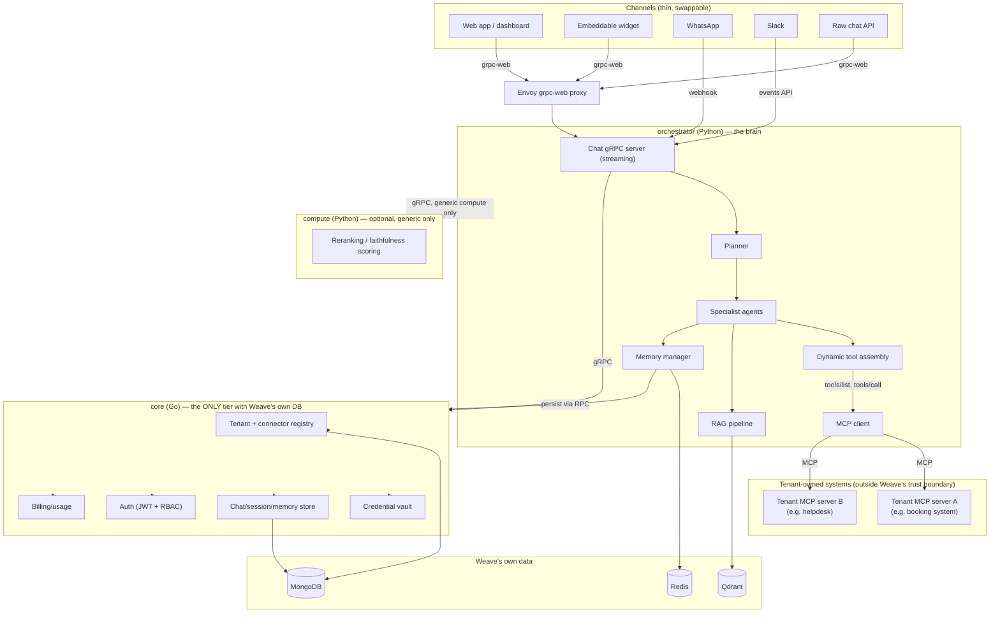

# Weave — Overview

## 1. What Weave is

Weave is a **plug-and-play AI assistant platform**. A tenant — a business or an individual — connects the systems they already run via the **Model Context Protocol (MCP)**, defines one or more **bot profiles**, and gets a conversational agent that can answer questions and take real actions against those systems. Weave never becomes the system of record for a tenant's business data; it's the orchestration and reasoning layer that sits in front of whatever they already have.

This is a deliberate inversion of the usual SaaS-AI pattern ("import your data into our platform"). The tradeoff: onboarding requires a connector (a small MCP server) instead of a form, but a tenant never has to trust Weave with their underlying data, and Weave never has to build bespoke integrations for every business it serves.

## 2. Core concepts

| Concept | What it means |
|---|---|
| **Tenant** | A business or an individual using Weave. The same primitive serves both — an individual is just a tenant with one bot profile and personal connectors (Gmail, Calendar, Notion) instead of a company's systems. |
| **Connector** | An MCP server (self-hosted by the tenant, or scaffolded from a Weave connector template) exposing that tenant's tools/resources — a booking system, a ticket queue, a personal inbox, whatever they run. Weave's orchestrator is an MCP *client*; it never requires connector-side data to live in Weave's own database. |
| **Bot profile** | A named configuration under a tenant — persona (system prompt), which connectors/tools it can use, which channels it's reachable on, which roles can reach it. A business typically runs at least two: `external` (customer-facing) and `internal` (staff-facing); an individual typically runs one. |
| **Channel** | A thin adapter translating a channel-native message (web widget, WhatsApp, Slack, raw API) into a call on Weave's chat API and back. Channels carry no business logic. |

## 3. The core loop

```mermaid
flowchart LR
    A[Tenant registers] --> B[Connect one or more MCP servers]
    B --> C[Define bot profile(s):<br/>persona, connectors, channels, roles]
    C --> D[Deploy: widget / WhatsApp / Slack / API]
    D --> E[User message arrives on a channel]
    E --> F[Orchestrator resolves tenant + active bot profile]
    F --> G[Planner assembles available tools dynamically<br/>from that profile's registered connectors]
    G --> H[Specialist agent(s) call tools via MCP]
    H --> I[Response streamed back through the channel]
```

## 4. High-level architecture



**Why this shape:**
- **`core` is the only tier holding Weave's own database credentials** — and it holds only *platform* data (tenant/connector registry, credential vault, chat history, auth, billing). It never becomes a tenant's CRM/ticketing/inventory system.
- **Tools are the LLM's only way to act, and MCP is the only way a tool reaches a tenant's system.** The planner never picks a URL or writes a query; it calls a tool by name, the tool resolves to an MCP `tools/call` against a registered connector.
- **Tool availability is dynamic, not hardcoded.** Each request assembles its tool list from the active bot profile's registered connectors' `tools/list`, filtered by the caller's RBAC role. Two tenants running the same orchestrator can have completely different capabilities.
- **Connectors are outside Weave's trust boundary.** A tenant's MCP server can misbehave (be slow, return garbage, go down) without that affecting any other tenant — isolation is enforced at the registry/credential layer, not by trusting the connector.

## 5. Tech stack

| Layer | Choice | Why |
|---|---|---|
| Contracts | Protocol Buffers (`protos/`) + `buf` codegen → Go + Python | One typed contract, no drift between caller and callee |
| Inter-service transport | gRPC (`google.golang.org/grpc`) | Typed, streaming-capable, standard tooling; browser/edge traffic via a dedicated Envoy grpc-web proxy |
| Platform data tier (`core`) | Go + official MongoDB driver | Fast, statically typed; the *only* tier with Weave's DB credentials |
| Database | MongoDB | Flexible schema for tenant/connector/config records; every collection is tenant-scoped |
| Orchestration (`orchestrator`) | Python + LangGraph | Explicit state machine for planner → agent → tool flows, checkpointing, human-in-the-loop |
| MCP client | Python `mcp` SDK | `initialize` → `tools/list` → `tools/call` against every registered connector |
| Schema/validation | Pydantic v2 | Tool I/O schemas, structured LLM output, config |
| LLM access | OpenAI-compatible API + Ollama | Same interface for cloud and local models |
| Compute (`compute`) | Python, one grouped server | Platform-generic compute only (RAG rerank, faithfulness scoring) — not tenant business logic, which lives in tenant connectors |
| Frontend (`web`) | Next.js 14 + TypeScript + Tailwind + shadcn/ui | Onboarding dashboard, admin console, chat UI, embeddable widget build |
| Cache/session | Redis | Short-term chat cache, rate limiting |
| Vector DB | Qdrant | RAG + semantic memory, one collection per tenant |
| Object storage | MinIO (S3-compatible) | Uploaded docs, generated assets |
| Observability | Langfuse + OpenTelemetry | Every planner decision, tool call, and MCP round trip traced |
| Auth | JWT (access+refresh) + RBAC | Verified by a shared interceptor; roles are tenant-scoped |
| Secrets | Credential vault (design pending — see `docs/architecture/SECURITY.md`) | Encrypted storage for tenant connector credentials |
| Deployment | Podman (local) → Kubernetes (prod) | Daemonless local dev, HPA-scaled production |

## 6. Repository structure

Weave is a **monorepo**.

```
weave/
├── core/              Go — tenant registry, connector registry, credential vault,
│                      chat/session/memory store, auth, billing/usage
├── orchestrator/      Python — chat gRPC server, LangGraph planner/agents,
│                      MCP client, dynamic tool assembly, RAG, memory
├── compute/           Python — grouped, platform-generic compute (optional; see §4 tradeoff notes)
├── connectors/        Reference MCP server(s) + connector templates (SDK for tenants
│                      who want to scaffold a connector instead of hand-writing MCP)
├── channels/          web-widget/, whatsapp/, slack/ — thin adapters, no business logic
├── web/               Next.js app: onboarding dashboard, admin console, chat UI,
│                      embeddable widget build
├── packs/             Tenant config templates: business.yaml/persona.yaml equivalents,
│                      vertical starter packs (clinic, e-commerce, law firm, ...)
├── packages/          shared-auth, shared-clients, connector-sdk
├── protos/            buf.yaml, buf.gen.yaml, every service contract
├── infra/             podman-compose.yml, containerfiles/, envoy/, k8s/
└── docs/
    ├── architecture/  ARCHITECTURE.md, SECURITY.md
    └── ...
```

## 7. Bot profiles — concrete shape

```yaml
tenant_id: acme-clinic
tenant_type: business          # business | individual
bot_profiles:
  external:
    persona: personas/external.md
    connectors: [acme-booking-mcp]
    channels: [web-widget, whatsapp]
    roles_allowed: [customer]
  internal:
    persona: personas/internal.md
    connectors: [acme-booking-mcp, acme-billing-mcp]
    channels: [slack]
    roles_allowed: [staff, admin]
```

An individual tenant looks the same, just smaller:

```yaml
tenant_id: user_9f2a
tenant_type: individual
bot_profiles:
  personal:
    persona: personas/default.md
    connectors: [gmail-mcp, gcal-mcp, notion-mcp]
    channels: [web-app]
    roles_allowed: [owner]
```

## 8. What's next

This repo is a fresh start — the design above is the target shape, nothing is implemented yet. See `docs/architecture/ARCHITECTURE.md` for the detailed request lifecycle and data model, and `docs/architecture/SECURITY.md` for the trust model this all depends on. A phased build plan will be written once the design in these docs is settled.
