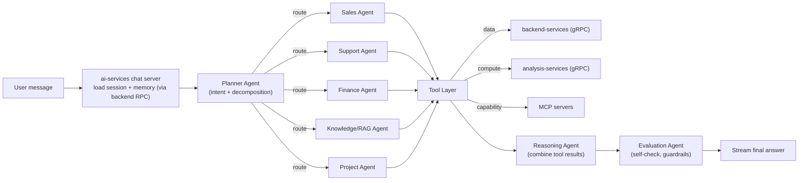
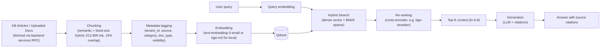
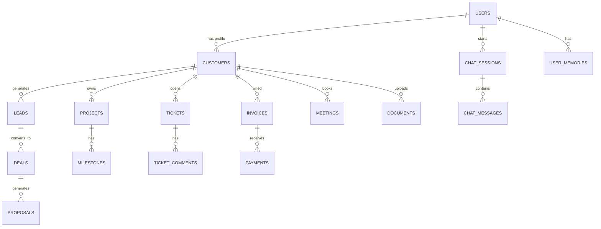
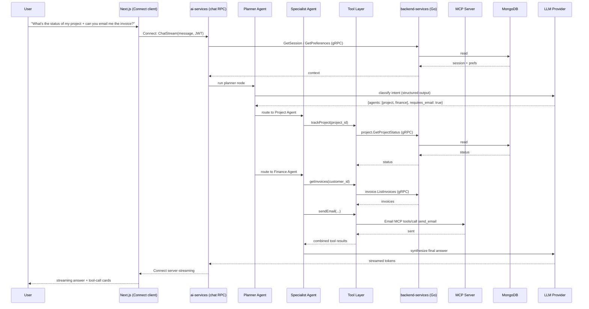
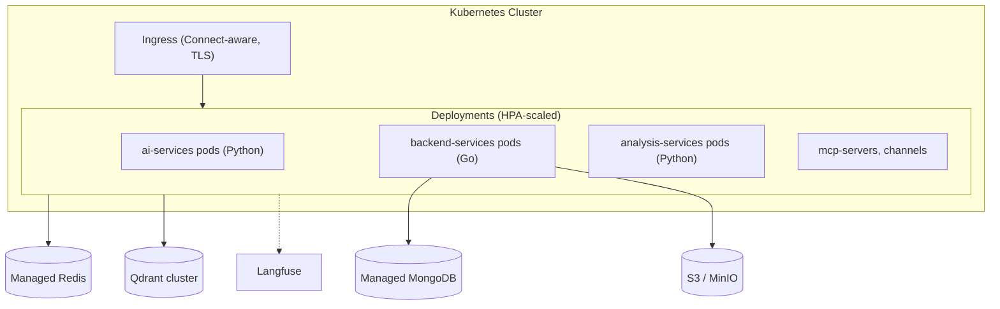

# ServiceSphere AI

**One AI Assistant for Every Customer Interaction — an open-source, multi-tenant backbone any firm can drop behind their own site, app, or WhatsApp number.**

An enterprise-grade, multi-agent AI SaaS **framework** — architected like ChatGPT Enterprise / Copilot / Agentforce, but open source and domain-agnostic. The core (agents, tools, MCP servers, RAG, memory, auth) is generic; what makes it *your* firm's assistant is a **domain pack** — a config bundle of business logic, knowledge base, and branding. The fully-built reference domain pack in this repo is an IT services company (Web, Mobile, AI/ML, Data Engineering, Cloud, DevOps, UI/UX, ERP/CRM, QA, Staff Augmentation, Support, Digital Marketing) — kept as a complete worked example, not a hardcoded assumption. See §21 for how a different firm (a clinic, an e-commerce shop, a law firm) plugs in.

**Two ways to consume this project:**
1. **As a firm**, fork it, write one `domain-packs/<your-firm>/` config, point it at your data, and get a chat assistant on your web app, an embeddable widget, a WhatsApp number, and/or the Streamlit demo — with no core code changes.
2. **As a learner**, build it from scratch phase by phase per `PLAN.md` to master modern AI engineering (multi-agent orchestration, RAG, MCP, memory, gRPC service design, production deployment) using the IT-services domain pack as the worked example.

This doc is the **master plan**. Each numbered section is a self-contained design doc. Treat this repo as a monorepo of **service groups**; every service group, agent, MCP server, domain pack, and channel adapter gets its own folder and its own deeper README as you build it (this doc tells you what those should contain).

---

## Architecture spine (read this first)

Four rules define the whole system. Everything else follows from them:

1. **Services are grouped into repos by concern and talk over gRPC (Connect protocol).** No REST-between-services, no shared in-process calls across groups.
2. **`protos/` is the single source of truth for every contract.** A capability doesn't exist until its `.proto` does. Stubs are generated with `buf` into both Go and Python.
3. **`backend-services/` (Go) is the *only* tier that touches MongoDB.** Every other service reaches data by calling a `backend-services` RPC. This is the data trust boundary, exactly like tools are the LLM's trust boundary.
4. **Compute is grouped, not exploded.** `analysis-services` (Python) is *one* server; each calculation/analysis capability is a module reached via a route — you add a function, not a deployment.

The browser/edge speaks **Connect** (HTTP/JSON + gRPC-Web from the same handlers, no Envoy). Local deployment is **Podman**.

---

## Table of Contents

1. [System Overview](#1-system-overview)
2. [Tech Stack](#2-tech-stack)
3. [High-Level Architecture](#3-high-level-architecture)
4. [Repository / Folder Structure](#4-repository--folder-structure)
5. [Service Groups & Services](#5-service-groups--services)
6. [AI Architecture (Agents, Planner, Orchestration)](#6-ai-architecture)
7. [Tool Calling Layer](#7-tool-calling-layer)
8. [MCP Servers](#8-mcp-servers)
9. [RAG System](#9-rag-system)
10. [Memory Architecture](#10-memory-architecture)
11. [External API Integrations](#11-external-api-integrations)
12. [Database Design (MongoDB)](#12-database-design)
13. [Contract & API Design Standards (gRPC/Connect)](#13-contract--api-design-standards)
14. [Auth (JWT + RBAC)](#14-auth)
15. [Frontend](#15-frontend)
16. [Sequence Diagrams](#16-sequence-diagrams)
17. [Observability & Evaluation](#17-observability--evaluation)
18. [Deployment (Podman → Kubernetes)](#18-deployment)
19. [Learning Roadmap](#19-learning-roadmap)
20. [Best Practices & Common Mistakes](#20-best-practices--common-mistakes)
21. [Domain Packs & Multi-Tenancy](#21-domain-packs--multi-tenancy)
22. [Channel Adapters (Web, WhatsApp, Streamlit, Slack)](#22-channel-adapters)
23. [Design System](#23-design-system)
24. [Open-Source Project Hygiene](#24-open-source-project-hygiene)

---

## 1. System Overview

**Problem**: An IT services company has 14 disconnected workflows (leads, tickets, invoices, proposals, meetings, docs...). Customers and staff want one conversational front door that can *actually act* — not a FAQ bot.

**Solution**: A chat-first platform where a **Planner Agent** decomposes a request, routes it to specialist agents, which call **tools**. Tools reach exactly three places: **`backend-services`** (Go) for anything touching the database, **`analysis-services`** (Python) for calculations/analysis, or **MCP servers** for reusable, standardized, cross-client capabilities. Retrieval-augmented generation grounds answers in company docs. Everything streams back token-by-token over Connect.

**Two portals, one brain**:
- **Customer Portal** — talk to the assistant to get a quote, open a ticket, check invoice status, upload a doc, book a call.
- **Admin Portal** — staff use the same assistant (with elevated tools) to manage leads, generate proposals, monitor tickets, view analytics.

**Core design principles**:
- The LLM never talks to a database directly. It calls a *tool* — a thin, typed, validated function.
- The tool never talks to a database directly either. It calls a `backend-services` RPC. **Only `backend-services` (Go) holds Mongo credentials.**
- This double boundary (tool boundary for the LLM, data-service boundary for everything) is what makes the system production-safe, testable, and auditable.

---

## 2. Tech Stack

| Layer | Choice | Why |
|---|---|---|
| Service contracts | Protocol Buffers in `protos/` + `buf` codegen | One typed contract, generated into Go and Python; no drift between caller and callee |
| Inter-service transport | gRPC / Connect (connectrpc) | Typed, streaming-capable, one server speaks gRPC + gRPC-Web + HTTP/JSON |
| Data tier | **Go 1.23** + `connect-go` + MongoDB Go driver | Fast, statically-typed data-access servers; the *only* tier with DB creds |
| Database | **MongoDB** | Flexible document model, natural fit for evolving multi-tenant schemas; accessed only via `backend-services` |
| AI orchestration | **Python 3.12** + LangGraph | Explicit state machine for multi-agent flows, checkpointing, human-in-the-loop |
| Python service transport | `connecpy` (Connect for Python) | Same Connect endpoints reachable as gRPC internally and HTTP/JSON + gRPC-Web at the edge |
| AI framework (light use) | LangChain | Only for document loaders / text splitters / retrievers — not the orchestrator |
| Schema/validation | Pydantic v2 | LLM tool I/O schemas, structured output, config — mirrors protobuf where an LLM-facing schema is needed |
| Comparison track | Pydantic AI | A second, more "typed-Python-native" agent paradigm side by side |
| LLM access | OpenAI-compatible API (OpenAI / Groq / Together) + Ollama | Same interface for cloud and free local models (Llama, Qwen, Mistral) |
| Compute / analysis tier | **Python 3.12**, grouped Connect server | One server, capabilities as modules — `analysis-services` |
| Frontend | Next.js 14 (App Router) + TypeScript | SSR/streaming, file-based routing, RSC for dashboards; calls Connect directly |
| UI | Tailwind CSS + shadcn/ui | Accessible primitives, fast theming, dark mode free |
| Cache / queues | Redis 7 | Session cache, rate limiting, pub/sub for notifications |
| Vector DB | Qdrant (primary) / ChromaDB (local dev) | Qdrant for hybrid search + filtering in prod; Chroma for zero-infra local dev |
| Object storage | MinIO (S3-compatible) | Document uploads, generated PDFs, avatars |
| LLM/agent observability | Langfuse | Trace every agent step, tool call, token, cost, latency |
| Infra observability | OpenTelemetry → Grafana/Prometheus | Standard metrics/traces across all services |
| Auth | JWT (access + refresh) in Connect metadata + RBAC | Stateless auth, roles: customer, sales, support, admin, super_admin |
| Containers (local) | **Podman + `podman-compose`** | Daemonless, rootless, Docker-compatible CLI; one-command local environment |
| Orchestration (prod) | Kubernetes | `podman generate kube` as a starting point; HPA per service, rolling deploys |

---

## 3. High-Level Architecture

```mermaid
flowchart TB
    subgraph Channels["Channel Adapters (thin, swappable front doors)"]
        WebApp["Next.js Web App<br/>Customer + Admin Portal"]
        Widget["Embeddable Web Widget"]
        WA["WhatsApp Adapter"]
        SL["Streamlit Demo Chatbot"]
        Slack["Slack Adapter (optional)"]
    end

    subgraph AI["ai-services (Python) — orchestration"]
        AIGW["Connect chat server<br/>(session, streaming, entrypoint)"]
        Planner["Planner Agent (LangGraph)"]
        Agents["Specialist Agents<br/>Sales / Support / Finance / Project / Knowledge / ..."]
        ToolLayer["Tool Layer<br/>(typed functions, validation)"]
        RAGSvc["RAG Pipeline"]
        MemSvc["Memory Manager"]
    end

    subgraph Analysis["analysis-services (Python) — grouped compute"]
        ACommon["Common Connect server"]
        AMods["Modules via routes:<br/>estimation · analytics · scoring · extraction"]
    end

    subgraph MCP["MCP Servers (standalone processes)"]
        MCP1["Calendar MCP"]
        MCP2["Email MCP"]
        MCP3["Filesystem MCP"]
        MCPn["... GitHub, Browser, ..."]
    end

    subgraph Backend["backend-services (Go) — THE ONLY DB TIER"]
        BGW["data-access Connect servers"]
        Repos["repositories + index bootstrap"]
    end

    subgraph Data["Data Layer"]
        Mongo[(MongoDB)]
        Redis[(Redis)]
        Qdrant[(Qdrant Vector DB)]
        MinIO[(MinIO Object Store)]
    end

    subgraph Obs["Observability"]
        Langfuse["Langfuse"]
        OTel["OpenTelemetry Collector"]
    end

    WebApp -->|Connect: HTTP/JSON or gRPC-Web| AIGW
    Widget -->|Connect| AIGW
    WA -->|webhook, translated to chat RPC| AIGW
    SL -->|Connect| AIGW
    Slack -->|events API, translated| AIGW

    AIGW --> Planner --> Agents --> ToolLayer
    ToolLayer -->|gRPC| BGW
    ToolLayer -->|gRPC| ACommon
    ToolLayer -->|MCP JSON-RPC| MCP
    ACommon -->|gRPC (needs data)| BGW
    MCP -->|gRPC (needs data)| BGW

    BGW --> Repos --> Mongo
    Agents --> RAGSvc --> Qdrant
    Agents --> MemSvc --> Redis
    MemSvc -->|persist via RPC| BGW
    BGW --> MinIO

    AIGW -.trace.-> Langfuse
    Backend -.metrics.-> OTel
    Analysis -.metrics.-> OTel
```

**Why this shape?**
- **`backend-services` is the only public entry point to the database.** No agent, no analysis module, no MCP server ever holds a Mongo connection. This shrinks the blast radius to one Go tier that can be reviewed and locked down independently.
- **`ai-services` is a service like any other, not magic** — it owns sessions, streaming, and kicks off the LangGraph run. It reaches data only through `backend-services` RPCs.
- **`analysis-services` is grouped** — one server, many capabilities-as-modules. "Add a pricing calculation" means adding a module + a route, not standing up a new deployment. When a module needs data, it calls `backend-services` like everyone else.
- **Tools never touch infra directly.** They call a `backend-services` RPC (data), an `analysis-services` route (compute), or an MCP server. Everything is auditable in Langfuse.
- **MCP servers wrap capabilities**, they don't own data. MCP is the *standardized* interface for anything that should be reusable by other AI clients (Claude Desktop, Cursor, a partner's agent) — filesystem, email, calendar, GitHub, browser. When an MCP server needs firm data, it too calls `backend-services`.
- **Channels are thin and swappable.** Every channel does the same two things: turn a channel-native message into a call to `ai-services`' chat RPC, and turn the streamed response back into that channel's format. None contain business logic — see §22.

---

## 4. Repository / Folder Structure

```
servicesphere-ai/
├── protos/                            # SINGLE SOURCE OF TRUTH for all contracts (buf codegen)
│   ├── buf.yaml
│   ├── buf.gen.yaml                   # generates Go (backend) + Python (ai/analysis) stubs
│   ├── database/v1/                   # EVERY stored schema, one entity per file (ticket.proto, invoice.proto, ...)
│   │                                   # plus shared value types (Money, Page, TenantScope, ...).
│   │                                   # Collection-backed messages carry an `is_collection: true` comment.
│   ├── backend_services/
│   │   └── data_access/v1/            # RPC contracts ONLY — Request/Response + service defs, import the
│   │                                   # matching entity from database/v1, never redeclare its fields
│   ├── ai_services/v1/                # chat.proto (server-streaming), planner.proto
│   └── analysis_services/v1/          # estimation.proto, analytics.proto, ...
│
├── backend-services/                  # GO — the ONLY tier that touches MongoDB (see backend-services/CLAUDE.md)
│   ├── main.go                        # THE backend Connect/gRPC server entrypoint, at module root
│   ├── configs/                       # env-based config (Vars)
│   ├── mongodb/                       # RPC-per-collection: the only package that touches Mongo
│   │   ├── initialize.go              # Queries interface, DbType, package-level Db, InitDatabase()
│   │   ├── collections.go             # ColNames — the single registry of collection name strings
│   │   ├── indexes.go                 # index bootstrap (Mongo is schemaless, so this is "migrations")
│   │   ├── health.go                  # periodic Mongo ping loop -> Healthy
│   │   └── ticket.go  invoice.go  ...  # one file per collection: interface + DbType methods
│   ├── rpc_services/
│   │   └── ticket/  invoice/  ...     # one pkg per collection: server.go + routehandler.go (thin,
│   │                                   # delegates to mongodb/ only — no business logic here)
│   ├── health/                        # thin Connect adapter for the shared HealthService
│   ├── gen/                           # generated Go stubs (do not hand-edit)
│   ├── go.mod
│   └── CLAUDE.md                      # this service's own house rules + "adding a collection" steps
│
├── ai-services/                       # PY — LangGraph orchestration
│   ├── server/                        # Connect chat server (streaming) = core entrypoint
│   │   └── chat_service.py
│   ├── graph/                         # LangGraph: state.py, planner.py, router.py, build_graph.py
│   ├── agents/                        # one file per specialist agent
│   ├── tools/                         # typed tool functions (call backend/analysis/MCP over gRPC)
│   ├── rag/                           # chunking, embedding, retrieval, rerank
│   ├── memory/                        # short/long-term memory managers (persist via backend RPC)
│   ├── mcp_clients/                   # MCP client wrappers per server
│   ├── llm/                           # provider abstraction (OpenAI-compat + Ollama)
│   ├── evals/                         # offline + online evaluation harness
│   ├── gen/                           # generated Python stubs (do not hand-edit)
│   └── pyproject.toml
│
├── analysis-services/                 # PY — grouped compute (ONE server, modules via routes)
│   ├── server/                        # the ONLY entrypoint; its endpoints are the shared surface
│   │   └── app.py                     # registers every capability module's route
│   ├── estimation/                    # e.g. estimateProject math (module, not a deploy)
│   ├── analytics/                     # aggregations for dashboards/getAnalytics
│   ├── scoring/                       # eval/faithfulness scoring, ranking helpers
│   ├── gen/
│   └── pyproject.toml
│
├── frontend-services/                 # All UI surfaces
│   ├── web/                           # Next.js customer + admin portal (Connect client)
│   │   ├── app/  components/  lib/  hooks/  styles/
│   └── streamlit-demo/                # Reference "try it live" channel
│       ├── app.py  theme.py  trace.py  .streamlit/config.toml  requirements.txt
│
├── channels/                          # Thin adapters: channel-native <-> ai-services chat RPC (§22)
│   ├── web-widget/
│   ├── whatsapp/
│   └── slack/
│
├── domain-packs/                      # Per-firm/per-vertical config (§21)
│   ├── _template/                     # business.yaml, branding.yaml, system_prompt.md, knowledge/
│   └── it-services/                   # Reference implementation used throughout PLAN.md
│
├── mcp-servers/                       # Standalone MCP servers (own process, own transport)
│   ├── calendar-mcp/  email-mcp/  filesystem-mcp/  knowledge-mcp/  github-mcp/  browser-mcp/  ...
│       # Each: server.py, resources.py, tools.py, prompts.py, README.md
│
├── packages/                          # Shared across services
│   ├── proto-stubs/                   # convenience re-exports of generated Go/Python stubs
│   ├── shared-auth/                   # JWT verify Connect interceptor, RBAC helpers (Go + Py)
│   └── shared-clients/                # pre-wired Connect clients to backend/analysis services
│
├── infra/
│   ├── podman-compose.yml             # Full local stack (mongo, redis, qdrant, minio, langfuse, services)
│   ├── podman-compose.override.yml    # Dev overrides (hot reload / mounted source)
│   ├── containerfiles/                # Per-service Containerfile (Podman-native Dockerfile)
│   ├── k8s/
│   │   ├── base/                      # Kustomize base manifests per service
│   │   └── overlays/{dev,staging,prod}/
│   └── observability/
│       ├── otel-collector-config.yaml
│       ├── grafana/
│       └── langfuse/
│
├── docs/
│   ├── architecture/                  # This doc's diagrams, ADRs
│   ├── api/                           # Generated proto/Connect reference per service
│   └── roadmap/                       # Phase-by-phase learning material
│
├── .github/
│   ├── workflows/                     # CI: buf lint/breaking, go test, pytest, build images
│   ├── ISSUE_TEMPLATE/
│   └── PULL_REQUEST_TEMPLATE.md
├── scripts/
│   └── new-firm.sh                    # Scaffolds a new domain-packs/<firm>/ from _template/
├── .env.example
├── CLAUDE.md
├── PLAN.md
├── DESIGN.md
├── LICENSE
├── CONTRIBUTING.md
├── CODE_OF_CONDUCT.md
├── SECURITY.md
├── CHANGELOG.md
└── README.md
```

---

## 5. Service Groups & Services

Three backend concerns, three groups. Frontend and channels sit in front of them.

### 5.1 `backend-services` (Go) — the data tier

The **only** tier with MongoDB credentials. One Connect/gRPC server (`backend-services/main.go`) registers one RPC service per collection, following the RPC-per-collection layout in `backend-services/CLAUDE.md`: `mongodb/<collection>.go` owns the Mongo access, `rpc_services/<collection>/` is the thin Connect handler. When any other service needs data, it calls one of these RPCs.

| Domain (data-access pkg) | Responsibility | Example RPCs | Owns Collections |
|---|---|---|---|
| **auth** | Register/login/refresh/logout, password reset, RBAC role assignment, JWT issuing | `Register`, `Login`, `Refresh`, `AssignRole` | `users`, `roles`, `permissions` |
| **customer** | Customer/org profiles, account settings | `GetCustomer`, `UpsertCustomer` | `customers`, `organizations` |
| **crm** | Leads, contacts, deals, pipeline stages | `CreateLead`, `UpdateDealStage` | `leads`, `contacts`, `deals` |
| **project** | Projects, milestones, tasks, status | `GetProjectStatus`, `AddMilestone` | `projects`, `milestones`, `tasks` |
| **ticket** | Support tickets, SLA timers, priority queue | `CreateTicket`, `UpdateTicket`, `GetTicket` | `tickets`, `ticket_comments` |
| **invoice** | Invoice generation, payment status | `CreateInvoice`, `ListInvoices` | `invoices`, `payments` |
| **proposal** | Proposal drafts, versioning, approval status | `CreateProposal`, `AddProposalVersion` | `proposals`, `proposal_versions` |
| **notification** | Store + fan-out notifications (send via Redis pub/sub or Email MCP) | `EnqueueNotification` | `notifications` |
| **calendar** | Availability, meeting booking, reminders | `GetAvailability`, `BookMeeting` | `meetings`, `availability_slots` |
| **analytics** | Read/write pre-aggregated dashboard snapshots | `GetOverview`, `PutSnapshot` | `analytics_snapshots` |
| **knowledge-base** | Articles, categories, versioning (source for RAG ingestion) | `ListArticles`, `UpsertArticle` | `kb_articles`, `kb_categories` |
| **document** | Upload metadata, text-extraction status, MinIO keys | `CreateDocument`, `GetDocument` | `documents` |
| **chat** | Sessions, messages, memories, preferences | `AppendMessage`, `GetSession`, `WriteMemory`, `GetPreferences` | `chat_sessions`, `chat_messages`, `user_memories`, `user_preferences` |

Every RPC is tenant-scoped (`tenant_id` in the request), enforces RBAC via a shared interceptor, and returns errors as Connect status codes with structured details (§13).

### 5.2 `ai-services` (Python) — orchestration

The chat entrypoint and the brain. Exposes a **server-streaming** chat RPC over Connect that browsers/channels hit directly. Runs the LangGraph Planner → specialist agents → tools flow (§6), the RAG pipeline (§9), and memory (§10). Holds **no** database credentials — every read/write goes through a `backend-services` RPC. See §6–§10.

### 5.3 `analysis-services` (Python) — grouped compute

One common Connect server. Each calculation/analysis capability (`estimation`, `analytics`, `scoring`, `extraction`, ...) is a **module reached by a route on that one server**, *not* a separately deployed service. This is deliberate: these capabilities are pure functions over inputs, cheap to co-locate, and easier to reason about as one bounded compute surface. A module that needs firm data calls `backend-services`; it never opens a DB connection. Promote a module to its own service only if it genuinely needs independent scaling — and that's a design discussion, not a default.

### 5.4 Frontend & channels

`frontend-services/web` (Next.js) and `frontend-services/streamlit-demo` are UI surfaces; `channels/*` are thin adapters. All of them speak to `ai-services`' chat RPC over Connect and nothing else. See §15, §22.

---

## 6. AI Architecture

### 6.1 Orchestration model: Planner → Specialist Agents → Tools



LangGraph models this as a **StateGraph**: nodes are agents/tools, edges are conditional routes decided by the Planner's structured output (a Pydantic model like `PlannerDecision{intent, agents_needed, requires_rag, requires_clarification}`). State is checkpointed after every node so a conversation can be paused/resumed and inspected in Langfuse.

### 6.2 Agent roster

| Agent | Job | Typical tools it calls |
|---|---|---|
| Planner Agent | Classify intent, decide which specialist agent(s) to invoke, detect if clarification is needed | none (pure reasoning + structured output) |
| Reasoning Agent | Merge multiple agents' outputs into one coherent answer | none |
| Customer Agent | Account/profile questions | `getCustomer`, `updateCustomerProfile` |
| Sales Agent | Lead capture, pricing estimates | `createLead`, `estimateProject` |
| Proposal Agent | Draft/update proposals | `generateProposal` |
| Project Agent | Project status, milestones | `trackProject` |
| Finance Agent | Invoices, payments | `getInvoices`, `generateInvoice` |
| Support Agent | Tickets | `createTicket`, `getTicketStatus` |
| Knowledge Agent | FAQ / policy answers | `searchKnowledge` |
| RAG Agent | Deep document Q&A over uploaded/company docs | retrieval pipeline (§9) |
| Document Agent | Summarize/extract from uploaded files | `uploadDocument`, `summarizeDocument` |
| Calendar Agent | Book/reschedule meetings | `bookMeeting` |
| Email Agent | Draft/send transactional emails | `sendEmail` |
| Workflow Agent | Multi-step processes (e.g., "onboard new client") | orchestrates several tools in sequence |
| Memory Agent | Read/write long-term memory & preferences | memory store (§10), via backend RPC |
| Evaluation Agent | Post-hoc check: hallucination, policy compliance, tone | may call `analysis-services/scoring` |

`estimateProject` and `getAnalytics` resolve to **`analysis-services`** routes (compute); the rest resolve to **`backend-services`** RPCs (data) or MCP servers.

### 6.3 Why LangGraph over plain LangChain chains

- Explicit **state** object shared across nodes (vs. implicit chaining).
- **Conditional edges** = real branching logic, not prompt-guessed routing.
- **Checkpointing** enables human-in-the-loop approval (e.g., "confirm before sending invoice") and resumable long-running workflows.
- Visual graph = easier to reason about and debug than a chain of `.pipe()` calls.

### 6.4 Pydantic AI comparison track

Build the *same* Sales Agent twice: once in LangGraph, once in Pydantic AI. Compare:
- LangGraph: graph-first, great for multi-agent branching, more boilerplate.
- Pydantic AI: function-first, dependency injection via `RunContext`, less ceremony for single-agent tool use, weaker for complex branching.
Use this comparison as a hands-on lesson, not a permanent fork of the codebase.

---

## 7. Tool Calling Layer

Tools are the **only** thing an LLM is allowed to invoke, and a tool is the **only** way an agent reaches another service. Every tool is a typed Python function with a Pydantic input/output schema, registered with a docstring the LLM sees as its function-calling spec. Under the hood it calls a **generated Connect client** — never a DB, never raw HTTP.

```python
# ai-services/tools/crm_tools.py
from pydantic import BaseModel, Field
from ai_services.clients import crm_client  # generated Connect client to backend-services

class CreateLeadInput(BaseModel):
    name: str
    email: str
    company: str | None = None
    interest: str = Field(description="Service the lead is interested in, e.g. 'Cloud Migration'")

class CreateLeadOutput(BaseModel):
    lead_id: str
    status: str

async def create_lead(input: CreateLeadInput, *, tenant_id: str, role: str) -> CreateLeadOutput:
    """Create a new sales lead in the CRM. Use this when a user expresses interest
    in a service and provides contact info."""
    resp = await crm_client.create_lead(  # gRPC call into backend-services (Go) — the only DB tier
        tenant_id=tenant_id, name=input.name, email=input.email,
        company=input.company, interest=input.interest,
    )
    return CreateLeadOutput(lead_id=resp.lead_id, status=resp.status)
```

**Where a tool resolves to:**
1. **Needs firm data (read/write)?** → a `backend-services` RPC. Always. Never a DB call, never a call that bypasses the Go tier.
2. **Needs a calculation/analysis?** → an `analysis-services` route.
3. **Needs a reusable/standardized capability (calendar, email, filesystem, browser, GitHub)?** → an MCP server.
4. **Needs a public commodity fact (weather, currency, news)?** → an external API tool, cached in Redis with a short TTL.

The LLM only chooses *which tool* and supplies *arguments*. The tool function hardcodes the destination — the LLM never picks a URL, endpoint, or RPC target.

**Core tool catalog**: `createLead`, `createTicket`, `getInvoices`, `estimateProject`, `generateProposal`, `bookMeeting`, `uploadDocument`, `summarizeDocument`, `searchKnowledge`, `sendEmail`, `trackProject`, `generateInvoice`, `getAnalytics`.

---

## 8. MCP Servers

MCP (Model Context Protocol) standardizes how an AI client discovers and calls **resources**, **tools**, and **prompts** exposed by a server, over a defined **transport** (stdio for local/dev, HTTP+SSE or Streamable HTTP for remote/prod). Each server below is a separate process so it can be reused by *any* MCP-compatible client (this platform's AI Gateway, but also Claude Desktop, Cursor, etc.) — that reusability is the whole point of choosing MCP over a plain internal tool for these. **When an MCP server needs firm data, it calls `backend-services` over gRPC like everything else — it does not touch Mongo.**

| MCP Server | Why it exists | Example Resources | Example Tools | Example Prompts | Transport |
|---|---|---|---|---|---|
| Filesystem MCP | Safe, sandboxed read/write to a docs/uploads directory | `file://uploads/{id}` | `read_file`, `write_file`, `list_dir` | `summarize_file` | stdio (dev), HTTP (prod) |
| Email MCP | Send transactional/marketing email through one governed choke point | `email://templates/{id}` | `send_email` | `draft_followup` | HTTP+SSE |
| Calendar MCP | Meeting booking against real availability (data via backend calendar RPC) | `calendar://availability` | `book_meeting`, `cancel_meeting` | `suggest_times` | HTTP+SSE |
| Knowledge MCP | FAQ/policy lookup, backs the Knowledge Agent | `kb://articles/{id}` | `search_articles` | `answer_from_kb` | HTTP+SSE |
| Document MCP | Upload/parse/summarize customer documents | `doc://{id}` | `extract_text`, `summarize` | `summarize_contract` | HTTP+SSE |
| Analytics MCP | Read-only metrics for dashboards & agent answers | `analytics://overview` | `get_kpis` | `explain_trend` | HTTP+SSE |
| GitHub MCP | Dev-facing: PR status, issues for the Project Agent when project = internal dev work | `repo://{org}/{repo}/issues` | `list_prs`, `create_issue` | `summarize_pr` | HTTP (official GitHub MCP or self-hosted) |
| Browser MCP | On-demand web lookups the RAG index doesn't have | — | `navigate`, `extract_page_text` | `research_topic` | stdio/HTTP (headless browser) |

> Note: there is deliberately **no "Database MCP."** Direct DB access is not a capability we expose to any AI client — all data goes through `backend-services`' typed, RBAC-checked RPCs. Analytics/knowledge reads are exposed as *narrow, purpose-built* MCP tools backed by those RPCs, never as raw query access.

**How the client communicates (standard flow for all of the above):**
1. `ai-services`' MCP client sends `initialize` → server responds with capabilities.
2. Client calls `tools/list`, feeds the schemas to the LLM as available functions for that turn.
3. LLM emits a tool call → client sends `tools/call` with JSON arguments → server executes (calling `backend-services` if it needs data) → returns structured `content`.
4. For long-running calls, the server can stream partial results (Streamable HTTP).
5. All calls are traced in Langfuse as spans nested under the parent agent step.

Each `mcp-servers/*` folder ships: `server.py`, `resources.py`, `tools.py`, `prompts.py`, and its own `README.md` — treat each as a tiny, independently versioned product.

---

## 9. RAG System



- **Source of documents**: the raw articles/docs live in Mongo and are read through `backend-services`' `knowledge-base`/`document` RPCs. The RAG pipeline in `ai-services` never queries Mongo directly — it asks `backend-services` for the source rows, then chunks/embeds/indexes into Qdrant.
- **Chunking**: hybrid of fixed-token windows and semantic/structure-aware splitting so a chunk never cuts mid-thought. Overlap ~15%.
- **Metadata**: every chunk stores `tenant_id`, `source_id`, `category`, `doc_type`, `visibility`, `updated_at` — used for filtering *and* access control (a customer's RAG query must never retrieve another customer's — or another tenant's — documents).
- **Hybrid Search**: dense vector similarity + sparse BM25 (Qdrant native), because pure embeddings miss exact terms like invoice numbers or ticket IDs.
- **Re-ranking**: a cross-encoder re-scores the top ~20 hybrid candidates down to the best 4–8. Cheap embeddings are recall; reranking is precision. The reranker can live as a `scoring` module in `analysis-services`.
- **Evaluation**: an offline eval set of (question, expected source) pairs scored on retrieval **recall@k** and **faithfulness**, run by the Evaluation Agent / a CI eval job, tracked in Langfuse.

---

## 10. Memory Architecture

| Type | Storage | Scope | Example |
|---|---|---|---|
| **Short-term (working) memory** | In-graph LangGraph state, Redis-backed session cache | Current turn/session | Last N messages, current tool results |
| **Conversation memory** | MongoDB `chat_messages` (full transcript, via backend `chat` RPC) + Redis (hot cache) | Per session, resumable | Full chat history for the session |
| **Long-term memory** | MongoDB `user_memories` (structured facts) + Qdrant for semantic recall | Per user, across sessions | "Prefers async communication", "Discussed CRM pricing on 5/2" |
| **Semantic memory** | Qdrant collection of embedded memory facts | Cross-session, retrieved like RAG | Retrieve relevant past facts when semantically related to the new query |
| **User preferences** | MongoDB `user_preferences` (structured key/value, via backend `chat` RPC) | Per user | Preferred contact channel, timezone, budget range |

The **Memory Agent** decides, after each turn, whether anything is worth persisting (a lightweight structured-output check), then writes it — **through `backend-services`' `chat` RPCs**, plus the semantic embedding into Qdrant. On a new turn, `ai-services` pre-loads: last-K short-term messages (Redis) + top-N semantically relevant long-term memories (Qdrant) + structured preferences (backend RPC) — assembled into the system context before the Planner runs.

---

## 11. External API Integrations

| API | Used by | Notes |
|---|---|---|
| Weather | a general-purpose "assistant utility" tool | Cached 30 min in Redis |
| Currency exchange | Finance Agent (multi-currency invoices) | Cached 1 hr |
| GitHub | Project Agent (via GitHub MCP) | For internal dev-project tracking |
| Google Maps | Customer Agent (office locations, timezone from address) | |
| News | Sales Agent (talk track: recent company news) | |
| Wikipedia | Knowledge Agent fallback for general knowledge outside the KB | |
| Public APIs (generic) | Any agent, via a generic `httpFetch` tool with an allowlist | Allowlist prevents SSRF |

**Internal vs. external decision, concretely**: the Planner's structured output includes a `data_domain` field. `company_private` → resolves to a `backend-services` RPC or an MCP tool. `public_commodity` → an external API tool. This is a hardcoded routing table (domain → tool), not something the LLM improvises, so a hallucinated "internal-sounding" query can't accidentally hit an external endpoint or vice versa.

---

## 12. Database Design

**MongoDB, accessed only through `backend-services`.** Each data-access domain (§5.1) owns a set of collections. Documents are the natural unit; embed where read-together, reference where independently queried. Every tenant-scoped collection carries a `tenant_id` field with an index, and IDs are stored as strings (ULID/ObjectId) rather than relational foreign keys — cross-collection relationships are references resolved by the owning domain's RPC.



Representative documents (fields shown illustratively; `_id` is a string ULID):

```jsonc
// tickets
{ "_id": "tkt_01H…", "tenant_id": "it-services", "customer_id": "cus_…",
  "subject": "Login broken", "priority": "high", "status": "open",
  "sla_due_at": "2026-07-22T10:00:00Z", "comments": [ /* embedded */ ],
  "created_at": "2026-07-21T09:20:00Z" }

// chat_messages
{ "_id": "msg_…", "tenant_id": "it-services", "session_id": "ses_…",
  "role": "assistant", "content": "…", "tool_calls": [ /* structured */ ],
  "created_at": "…" }

// user_memories
{ "_id": "mem_…", "tenant_id": "it-services", "user_id": "usr_…",
  "fact": "Prefers async communication", "embedding_id": "qdrant:…",
  "created_at": "…" }
```

**Indexing notes** (created by `backend-services/mongodb/indexes.go`):
- Compound `(tenant_id, _id)` on every collection; every query is tenant-scoped first.
- `(tenant_id, status)` on `tickets`; a partial index `WHERE status != 'closed'` for the hot support queue.
- `(tenant_id, customer_id, created_at desc)` on high-read list views (`invoices`, `tickets`).
- Text/secondary indexes on fields used in filters; vector similarity lives in Qdrant, not Mongo.
- Mongo is schemaless, so there are no Alembic-style migrations — instead `migrate/` is an idempotent bootstrap that ensures indexes and seed data on startup.

---

## 13. Contract & API Design Standards

Contracts are **Protocol Buffers in `protos/`**, generated with `buf` into Go and Python. There is no hand-written REST between services.

- **Versioning**: proto packages carry a version — `backend_services.data_access.v1`, `ai_services.v1`. Breaking changes go in a new version package; `buf breaking` guards this in CI.
- **Transport**: gRPC internally; Connect at the edge (the same handler answers gRPC, gRPC-Web, and HTTP/JSON). Streaming chat is a **server-streaming** RPC.
- **Auth**: JWT in Connect request metadata (`authorization` header). A shared interceptor (`packages/shared-auth`) verifies it on every RPC; service-to-service calls use a short-lived internal service token.
- **Validation**: request/response types come from protobuf and are enforced at the codegen boundary. Pydantic mirrors exist only for LLM-facing tool schemas.
- **Errors**: Connect/gRPC status codes (`invalid_argument`, `not_found`, `permission_denied`, ...) carrying a structured detail message: `ErrorDetail{ code: "TICKET_NOT_FOUND", message: "...", details: {...} }`.
- **Pagination**: cursor-based via request fields `page_token` / `page_size`; responses return `next_page_token`.
- **Idempotency**: create RPCs for billable resources (invoices, payments) take an `idempotency_key` field (or Connect `idempotency-key` header); `backend-services` dedupes on it.
- **Entity schemas live in `database/v1`, not in the RPC contract.** Every message that backs a MongoDB collection is defined once in `protos/database/v1/<entity>.proto`, marked with an `is_collection: true` comment, and *referenced* (never redeclared) by the `data_access` proto that exposes RPCs over it. This keeps the stored shape and the wire contract from drifting independently, and makes every collection greppable: `rg "is_collection: true" protos/database`. Its first field is always `_id` (Mongo's real primary key) so the entity is stored, via `UseJSONStructTags`, exactly as-is — no separate DTO. The one cost: protoc-gen-go can't emit `Id` as the Go name for a leading-underscore field, so it becomes `XId` (`t.XId`, `t.GetXId()`) — expected, not a bug, and `// buf:lint:ignore FIELD_LOWER_SNAKE_CASE` silences the style warning.

Example (Ticket): the entity lives in `database/v1`, the RPC contract in `data_access/v1` imports it.
```protobuf
// protos/database/v1/ticket.proto
package database.v1;

// is_collection: true
// Mongo collection "tickets", owned by backend-services/mongodb/ticket.go.
message Ticket {
  // buf:lint:ignore FIELD_LOWER_SNAKE_CASE
  string _id = 1;               // Mongo's real primary key -> Go field XId
  string tenant_id = 2;
  string subject = 3;
  string priority = 4;
  string status = 5;             // "open"
  string sla_due_at = 6;         // RFC3339
  string created_at = 7;
}
```
```protobuf
// protos/backend_services/data_access/v1/ticket.proto
package backend_services.data_access.v1;

import "database/v1/ticket.proto";

message CreateTicketRequest {
  string tenant_id = 1;
  string subject = 2;
  string priority = 3;
  string description = 4;
  string idempotency_key = 5;
}
message CreateTicketResponse {
  database.v1.Ticket ticket = 1;
}

service TicketService {
  rpc CreateTicket(CreateTicketRequest) returns (CreateTicketResponse);
  rpc GetTicket(GetTicketRequest) returns (GetTicketResponse);
  rpc ListTickets(ListTicketsRequest) returns (ListTicketsResponse); // cursor paginated
}
```

---

## 14. Auth

- **JWT**: short-lived access token (15 min) + refresh token (7 days, rotated). Issued by `backend-services`' `auth` domain (it owns the `users` collection). Carried in Connect metadata on every call.
- **RBAC roles**: `customer`, `sales_rep`, `support_agent`, `finance`, `admin`, `super_admin`. A shared `packages/shared-auth` interceptor verifies the JWT and injects `{user_id, tenant_id, role}` into the request context; handlers assert role with a helper (`requires_role("admin")`).
- **AI-tool-specific rule**: the tool layer in `ai-services` re-checks the caller's role before executing a sensitive tool (e.g., `generateInvoice` requires `finance` or `admin`) — the LLM's intent to call a tool is never sufficient authorization by itself. This is *in addition to* the RBAC re-check the `backend-services` RPC itself performs.

---

## 15. Frontend

Pages: **Landing**, **Login/Register**, **Customer Dashboard**, **Admin Dashboard**, **Chat** (streaming, tool-call cards), **Project Details**, **Invoices**, **Tickets**, **CRM board** (Kanban), **Knowledge Base browser**, **Settings**.

- **Transport**: the Next.js app is a **Connect client**. It calls `ai-services`' chat RPC (server-streaming) directly over HTTP/JSON or gRPC-Web — no bespoke REST BFF layer required, though route handlers can still proxy where a server-only secret is involved.
- **Streaming Chat UI**: consume the server-streaming chat response; render tokens as they arrive; render tool calls as collapsible "Agent is working" cards with live status (pending → running → done) fed by intermediate stream events, not just the final text.
- **Dark mode**: Tailwind `class` strategy + shadcn theme tokens, persisted in `localStorage`/user preference. Per `DESIGN.md`, dark is the default, not a toggle.

---

## 16. Sequence Diagrams

### Customer asks a question → full round trip



*(Additional diagrams for "Planner selects agents", "MCP server responds", and "Streaming response lifecycle" live under `docs/architecture/sequence/` as each phase is built.)*

---

## 17. Observability & Evaluation

- **Langfuse**: every LangGraph run = one trace; every agent node, tool call, cross-service RPC, and LLM call = a nested span with input/output/tokens/cost/latency. Tag traces with `tenant_id`, `user_id`, `session_id`, `agent_name`.
- **OpenTelemetry**: standard infra metrics/traces (RPC latency, error rate, Mongo query time) across all Go and Python services, exported to a collector → Prometheus/Grafana. gRPC/Connect interceptors emit spans automatically.
- **Evaluation Agent + offline evals**: golden dataset of (query → expected tool call / expected answer) pairs; run in CI on every `ai-services` change; regressions tracked in Langfuse's eval scoring. Faithfulness scoring can run as an `analysis-services/scoring` module.
- **Alerts**: SLA breach on tickets, elevated tool-call/RPC error rate, RAG faithfulness score below threshold.

---

## 18. Deployment

**Local dev**: `podman-compose -f infra/podman-compose.yml up -d` brings up MongoDB, Redis, Qdrant, MinIO, Langfuse, `backend-services`, `ai-services`, `analysis-services`, and the frontend — daemonless and rootless. Each service has a `Containerfile` under `infra/containerfiles/`. Because Podman is Docker-compatible, the same compose file works with Docker if a contributor prefers it, but Podman is the supported default.

**Production**: Kubernetes — one Deployment + Service per service, Horizontal Pod Autoscaler on CPU/RPS, Ingress terminating TLS, Kustomize overlays per environment (`dev`/`staging`/`prod`). `podman generate kube` produces a first-pass manifest from the local pods, which is then hardened into the Kustomize base. MongoDB and Redis run as managed cloud services in prod; MinIO can be swapped for real S3.



CI/CD (`.github/workflows`): `buf lint` + `buf breaking` → `go test` + `pytest` → build container images (Podman/Buildah) → push to registry → `kubectl apply -k overlays/staging` → smoke test → manual promote to prod.

---

## 19. Learning Roadmap

Each phase = **Theory → Concepts → Implementation → Exercise → Mini-project → Best practices → Common mistakes**. Build incrementally; don't start a phase until the previous phase's mini-project runs end-to-end.

| Phase | Focus | Mini-project |
|---|---|---|
| **0. Contracts & Data Tier** | protobuf, `buf`, gRPC/Connect, Go + MongoDB data-access service | One `backend-services` RPC (`CreateTicket`) writing a real Mongo document |
| **1. Basic Chat** | LLM fundamentals, prompt engineering, streaming, Connect server-streaming, Next.js wiring | A single chat RPC that streams responses, no tools yet |
| **2. Tool Calling** | Function calling schemas, structured output, tool → `backend-services` RPC | Chatbot that creates a real ticket in Mongo via a tool → gRPC → Go tier |
| **3. RAG** | Chunking, embeddings, Qdrant, hybrid search, reranking | Chat that answers from an ingested KB with citations |
| **4. Memory** | Short/long-term memory, conversation state, preferences | Assistant that remembers a user's name/preferences across sessions |
| **5. MCP** | MCP protocol, building a client and a server, resources/tools/prompts | Build one MCP server (Calendar MCP) and wire it into chat |
| **6. Multi-Agent** | LangGraph StateGraph, Planner pattern, conditional routing, Pydantic AI comparison | Planner routes between Sales, Support, and RAG agents correctly |
| **7. Grouped Compute** | `analysis-services` pattern: one server, modules via routes | `estimateProject` + `getAnalytics` as modules behind one compute server |
| **8. Production Contracts & Auth** | Full data-access domain split, JWT in metadata, RBAC interceptor, idempotency | All core domains behind the Go tier with JWT auth and role checks |
| **9. Monitoring** | Langfuse tracing, OpenTelemetry across Go + Python, offline evals | Dashboard showing trace costs, latencies, and a nightly eval score |
| **10. Deployment** | Podman → Kubernetes, CI/CD, autoscaling | Full stack deployed to a K8s cluster (local kind/minikube fine) |

The full module/topic breakdown, the exact doc path and required structure for each generated learning doc, and the reading order live in **`LEARNING.md`** — that file, not this section, is the source of truth for `docs/roadmap/**` content.

The early phases build the single reference domain pack (IT services) on one channel (the Next.js web app). `PLAN.md` continues with generalizing into config-driven domain packs, multi-tenancy, channel adapters, and open-source release readiness — see §21–24.

---

## 20. Best Practices & Common Mistakes

**Best practices**
- The database is a private detail of `backend-services`. If any other tier grows a Mongo import, that's a leak — add an RPC instead.
- Tools are the LLM's trust boundary — validate inputs with Pydantic, and let the tool (not the LLM) choose the RPC target.
- Start every capability from a `.proto` in `protos/`; regenerate stubs, never hand-edit `gen/`.
- Keep grouped compute grouped — a new calculation is a module + route in `analysis-services`, not a new deployment, until it demonstrably needs its own scaling.
- Trace every agent step, tool call, and RPC in Langfuse/OTel from day one — you cannot debug a multi-agent, multi-service system from terminal logs.
- Keep the Planner's output structured (Pydantic/JSON schema), never free-text routing.
- Treat MCP servers as products: version them, document their tool schemas; when they need data, they call `backend-services`.

**Common mistakes to avoid**
- Opening a Mongo connection from `ai-services` or `analysis-services` "just this once" — always through `backend-services`.
- Letting the LLM assemble a query or pick an endpoint — always through a typed tool with a hardcoded target.
- Skipping re-ranking in RAG because "vector search is good enough" — recall without precision floods the context window.
- One giant prompt trying to be every agent — narrow specialist agents outperform and are cheaper to debug.
- No idempotency key on billable actions (`generateInvoice`) — retried tool calls under network flakiness double-bill.
- Exploding `analysis-services` into a dozen tiny deployments — that's the thing this structure deliberately avoids.
- Jumping to Kubernetes before the Podman compose stack is stable — you'll debug two unknowns at once.

---

## 21. Domain Packs & Multi-Tenancy

**The core is generic. A domain pack is what makes it a specific firm's assistant.** A domain pack is a config bundle, not code — a new firm should never need to fork service source to onboard.

```
domain-packs/<firm-slug>/
├── business.yaml       # tenant_id, services offered, which agents/tools are enabled, RBAC role names
├── branding.yaml       # signal accent color, logo URL, display font override (DESIGN.md §7)
├── system_prompt.md    # base persona layered under the shared Planner/agent prompts
└── knowledge/          # seed docs ingested into this tenant's RAG namespace
```

`business.yaml` shape (illustrative):
```yaml
tenant_id: acme-clinic
display_name: "Acme Family Clinic"
agents_enabled: [customer, support, calendar, knowledge, rag]   # finance/proposal off — no invoicing needs
tools_enabled: [bookMeeting, searchKnowledge, createTicket]
channels: [web-widget, whatsapp]
core_version: ">=0.3.0"
```

**How it loads**: `ai-services` reads `tenant_id` from the incoming request (resolved per-channel — §22), loads that domain pack's config once (cached in Redis), and uses it to: filter which agents/tools are even offered to the Planner, prefix the system prompt, and scope every RAG/memory/data call to that tenant's namespace.

**Multi-tenancy mechanics**:
- **Data isolation**: every tenant-scoped Mongo collection has a `tenant_id` field + index, and every `backend-services` RPC requires and enforces `tenant_id`. Qdrant uses one collection per tenant (strongest isolation) or a shared collection with a mandatory `tenant_id` payload filter — start with one per tenant.
- **RBAC extends with tenant scope**: a role check becomes "role X *within tenant Y*", enforced by the shared auth interceptor.
- **Rate limits and cost tracking** are per-tenant at the edge, so one firm's spike can't degrade another's.
- **Onboarding a new firm** = `scripts/new-firm.sh <slug>` copies `_template/`, prompts for the fields above, runs KB ingestion against `knowledge/`, and prints the widget snippet / WhatsApp webhook URL.

---

## 22. Channel Adapters

Every channel does the same job: **translate a channel-native message into a call to `ai-services`' streaming chat RPC (over Connect), and translate the streamed response back.** No business logic lives in a channel adapter — that's what makes adding channel N+1 a small, isolated PR.

| Channel | Folder | Auth | Notes |
|---|---|---|---|
| **Next.js web app** | `frontend-services/web` | JWT (logged-in customer/admin) | Full-featured: dashboards + chat, Connect client |
| **Embeddable web widget** | `channels/web-widget` | Public API key scoped to one `tenant_id` | A `<script>` tag any firm drops in; renders a chat bubble, calls the chat RPC cross-origin (CORS scoped to the firm's domain) via gRPC-Web/JSON |
| **WhatsApp** | `channels/whatsapp` | Meta WhatsApp Cloud API webhook token | Resolves `tenant_id` from the WhatsApp Business phone number ID, calls the chat RPC, buffers the streamed response into one WhatsApp message |
| **Streamlit demo** | `frontend-services/streamlit-demo` | None (public demo) or a query-param API key | The reference "try it live" channel — see below |
| **Slack (optional)** | `channels/slack` | Slack signing secret + OAuth | Slash command / app-mention triggers the same chat RPC |

### Streamlit demo chatbot (priority reference implementation)

The fastest way for someone evaluating the project to see it work — no Next.js build, no auth flow, just `streamlit run app.py`.

- `app.py`: a `st.chat_message` loop that calls `ai-services`' streaming chat RPC (via the Connect/HTTP-JSON interface), streams tokens via `st.write_stream`, and renders the trace (`trace.py`) above each assistant turn.
- Takes a `--tenant` flag / sidebar selector to show off multiple seeded domain packs without code changes.
- Fully themed per `DESIGN.md` §5.
- Ships a minimal `Containerfile` so `podman-compose up streamlit-demo` is a one-liner.

### Deciding `tenant_id` per channel
- Web app / widget: from the JWT or the widget's scoped API key.
- WhatsApp/Slack: from the receiving phone number ID / workspace ID, mapped to a `tenant_id` in a small lookup collection maintained by the onboarding script (§21).
- Streamlit demo: explicit selector.

---

## 23. Design System

Full token system, the Live Signal Path signature element, chat/dashboard component rules, and how a firm white-labels it live in **`DESIGN.md`** — read that file before building any UI surface, in any channel.

The short version: dark-mode-first (graphite `#0B0E14`), a restrained accent (`#5B8CFF`) reserved for active/streaming states, Space Grotesk/IBM Plex Sans/IBM Plex Mono for display/body/data text, and one deliberate animation — a step trace showing the Planner → Agent → Tool/MCP → Response path a message actually took, rendered consistently across the Next.js app, the widget, and the Streamlit demo. A firm overrides the accent color and logo per `domain-packs/<firm>/branding.yaml`; the rest stays fixed so it still reads as one coherent product.

---

## 24. Open-Source Project Hygiene

Since this repo is meant to be forked and run by firms who are not its original authors, it needs the standard OSS surface:

- **`LICENSE`** — MIT.
- **`README.md`** (root, public-facing) — the GitHub landing page: what it is, quickstart (`podman-compose up`, run the Streamlit demo in under 10 minutes), supported channels, screenshot/GIF of the trace UI, link to this doc, license, contributing.
- **`CONTRIBUTING.md`** — how to run tests, coding conventions (points back to `CLAUDE.md`), and the extension points: add a domain pack, add a channel adapter, add an MCP server, add a data-access domain, add an analysis module.
- **`CODE_OF_CONDUCT.md`** — Contributor Covenant.
- **`SECURITY.md`** — private vulnerability reporting (this project handles customer PII for every adopting firm).
- **`CHANGELOG.md`** — Keep a Changelog format.
- **`.github/ISSUE_TEMPLATE/`** — bug report / new domain-pack request / new channel request.
- **Versioning**: tag releases (`v0.1.0`...); `buf breaking` guards contract compatibility; a domain pack declares which core version it targets (`business.yaml: core_version`).

---

### Next step

Start with **Phase 0** (`docs/roadmap/phase-0.md`): define the first contracts in `protos/`, generate stubs, and stand up `backend-services` with one real `CreateTicket` RPC writing to MongoDB — the data tier that every later phase builds on. Then Phase 1 adds the streaming chat RPC in `ai-services`. Generalization, multi-tenancy, and additional channels come later in `PLAN.md`, once the reference implementation works.
