# Weave — From Scratch

**A complete, self-contained account of what Weave is, why it exists in this exact
shape, every architectural decision behind it and what was rejected, and — topic by
topic — how you would build the whole thing from an empty directory.**

Read this if you want to *learn* Weave in full depth, or if you need to *pitch* it and
have to be able to answer the hard questions. Nothing here assumes you've read the other
docs; where a detail lives elsewhere in more depth, this file points at it.

---

## How to read this document

| Part | What it covers | Read it if you want to… |
|---|---|---|
| [I — The idea](#part-i--the-idea-and-the-need) | The problem, the inversion, why not the alternatives | Pitch it, or decide whether to build it |
| [II — The concepts](#part-ii--the-four-primitives-and-the-core-mechanic) | Tenant, connector, bot profile, channel; dynamic tool assembly; MCP | Understand the model before the code |
| [III — The architecture](#part-iii--architecture) | Services, request lifecycle, data model, trust boundaries, memory, multimodal | Understand how it actually runs |
| [IV — The decisions](#part-iv--why-these-choices-the-decision-log) | Every significant technical choice + what was rejected and why | Defend the design, or change it well |
| [V — Building it](#part-v--build-it-from-scratch) | Prerequisite skills, then the real phase-by-phase build order with concepts | Build this (or something like it) yourself |
| [VI — Status](#part-vi--status-honest-gaps-and-roadmap) | What's built, what's verified, what's honestly missing | Know what you're actually promising |
| [VII — Pitching](#part-vii--pitching-it) | The 60-second version, the demo, the hard questions | Walk into a room and defend it |

**Colour convention used in every diagram in this doc**, borrowed from Weave's own design
system (`DESIGN.md`): the platform's *own reasoning* is one thread, the *tenant's own
systems* are the other. They interlace but never merge — that's the entire product thesis
rendered as a visual rule.

---
---

# Part I — The idea and the need

## 1. The problem

Every business that runs software now wants a conversational assistant over it. A clinic
wants patients to ask "when's my appointment?"; a retailer wants "where's my order?"; an
accounting firm wants its clients to ask "is my GST filed?". Internally, the same
businesses want staff to ask "what's our inventory on SKU-4021?" without opening three
dashboards.

Today they have two real options, and both are bad.

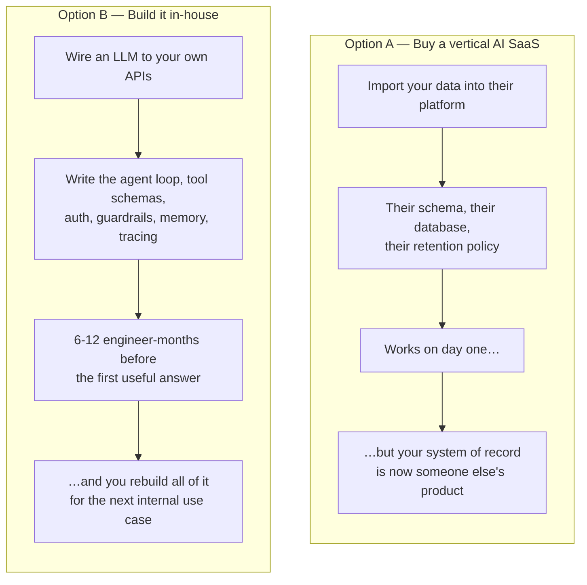

**Option A's real cost is custody.** The moment a clinic's patient records or a fintech's
transaction history is imported into a vendor's database, that vendor is in the
compliance blast radius, the data-residency conversation, and the migration-lock
conversation. For a regulated business this is often not a cost — it's a hard no.

**Option B's real cost is that none of it is differentiating.** The planner loop, the
tool-schema plumbing, the per-role visibility filter, the guardrail screen, the session
memory, the tracing — every company builds the same scaffolding, badly, and then owns it
forever.

## 2. The inversion — Weave's actual thesis

> **Weave is the connective layer, not the system of record.**

Instead of asking a business to move its data *in*, Weave reaches *out* — to whatever the
business already runs — and does only the part that is genuinely hard and genuinely
generic: the reasoning, the routing, the tool orchestration, the isolation, and the
auditability.

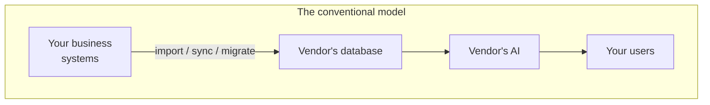

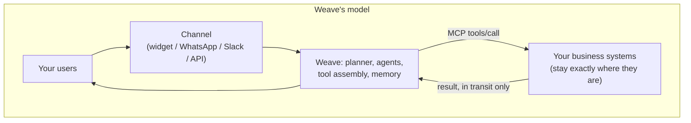

The consequences of that one inversion are the whole design:

| Because Weave never holds tenant data… | …this follows |
|---|---|
| Onboarding is a *connector*, not a data migration | A tenant is live in hours, not a quarter |
| Weave never has to model a tenant's domain | The same core serves a clinic, a retailer, and one individual's inbox |
| A tenant can revoke access instantly | Trust is structural, not contractual |
| Weave's own DB holds only platform data | A Weave breach cannot leak a tenant's business records — there's no copy to leak |
| Two tenants can have completely different capabilities | Tools are assembled per request, never compiled in |

## 3. Why not something else?

This is the question every serious listener asks. Here is the honest comparison.

| Approach | Data custody | Integration effort | Can it *act*, not just answer? | Multi-tenant by design? | Lock-in |
|---|---|---|---|---|---|
| **Vertical AI SaaS** (industry-specific assistant products) | ❌ Your data in their DB | Low | Usually yes, within their model | N/A (you're the tenant) | ❌ High — they own the record |
| **RAG chatbot builders** (upload docs, get a bot) | ⚠️ Documents copied to their store | Low | ❌ Read-only; can't take actions | N/A | ⚠️ Medium |
| **Roll your own** (LangChain/LangGraph + your APIs) | ✅ Yours | ❌ Very high — you build everything | ✅ Yes | ❌ You'd have to build it | ✅ None |
| **Workflow tools + LLM** (Zapier/n8n + GPT step) | ⚠️ Passes through their cloud | Medium | ⚠️ Rigid, pre-wired flows only | ⚠️ Partial | ⚠️ Medium |
| **Hosted assistant APIs** (function-calling as a service) | ✅ Mostly yours | Medium — you still build orchestration, auth, isolation, UI | ✅ Yes | ❌ You build it | ⚠️ Provider-shaped |
| **Weave** | ✅ Never leaves your systems | Low — register connectors/tools, define a profile | ✅ Yes, via typed tools | ✅ First-class primitive | ✅ Open-core, self-hostable |

**The sharpest way to say it:** the roll-your-own column is the only one that gets data
custody *and* real actions right — and Weave is that column, productised, with the
multi-tenancy, isolation, and auditability already built.

### The objections worth pre-empting

| Objection | Honest answer |
|---|---|
| *"Isn't this just LangChain with extra steps?"* | LangGraph is **inside** Weave (`orchestrator`). LangChain gives you an agent loop; it gives you no tenant model, no connector registry, no credential vault, no per-role tool visibility, no guardrail enforcement, no per-tenant memory isolation, no channel layer. Those are the product. |
| *"Why MCP instead of your own plugin format?"* | Because a bespoke format makes every integration Weave's problem forever. MCP is an existing open protocol with a growing ecosystem — a tenant who already runs an MCP server is connected with zero new code. See [§7](#7-mcp-and-why-that-bet). |
| *"Onboarding still needs engineering effort."* | True, and it's the real tradeoff. Weave's answer is `mcp-gateway`: a tenant with an existing HTTP API registers endpoints via the SDK (or a whole OpenAPI spec in one call) and Weave hosts the MCP server on their behalf. See [§22](#22-mcp-gateway--removing-the-need-to-run-a-server). |
| *"What stops the model doing something destructive?"* | The model can only ever call a named, schema-validated, pre-registered tool that the active bot profile is allowed to use for that caller's role. It cannot construct a URL, write a query, or reach an unregistered endpoint. See [§12](#12-trust-boundaries-and-the-security-model). |

## 4. Who it's for — and the primitive that makes both work

Weave deliberately does **not** special-case "business" versus "consumer". A tenant is a
tenant.

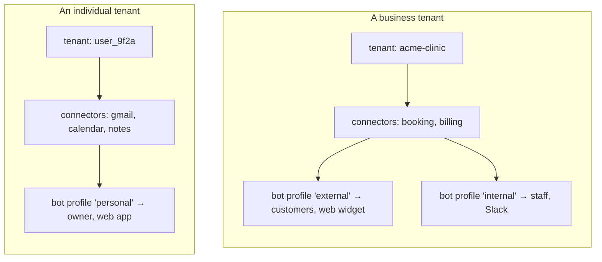

Same schema, same code path, different scale. This is not a marketing claim — it is
literally the same `tenants` collection and the same `ResolveBotProfile` RPC. If the
model had needed a special case for individuals, the abstraction would have been wrong.

---
---

# Part II — The four primitives and the core mechanic

## 5. The four primitives

Everything in Weave is built from exactly four concepts. Learn these and the rest of the
system is mostly mechanical.

| Primitive | Definition | Owned by | Example |
|---|---|---|---|
| **Tenant** | A business or individual using Weave. The isolation boundary for *everything*. | Weave (`core`) | `acme-clinic` |
| **Connector** | An MCP server exposing a tenant's tools/resources. Weave is an MCP *client*. | The tenant (hosted anywhere) | `acme-booking-mcp` |
| **Bot profile** | A named config under a tenant: persona, allowed connectors/tools, channels, allowed roles, guardrails, LLM choice. | Weave (`core`) | `external`, `internal` |
| **Channel** | A thin adapter translating a channel-native message into a chat-API call and back. No business logic. | Weave | `web-widget`, `slack` |

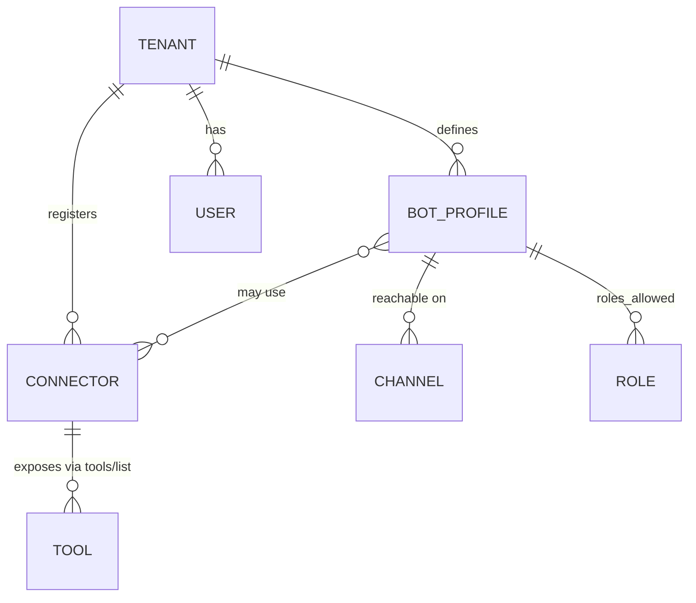

The key relationship to internalise: **a bot profile does not own tools — it *selects*
from the tenant's connectors.** One tenant, one tool registry, many profiles, each seeing
a different slice. That's what makes "customer-facing bot" and "staff-facing bot" a config
decision rather than two deployments.

## 6. The core mechanic — dynamic tool assembly

If you remember one technical thing about Weave, remember this.

A conventional agent ships knowing its tools: they're in the source code, decided at build
time. Weave's orchestrator **ships knowing nothing**. On every single request it asks the
tenant's registered connectors what they can do, filters that by who's asking, and hands
the result to the planner as that turn's available functions.

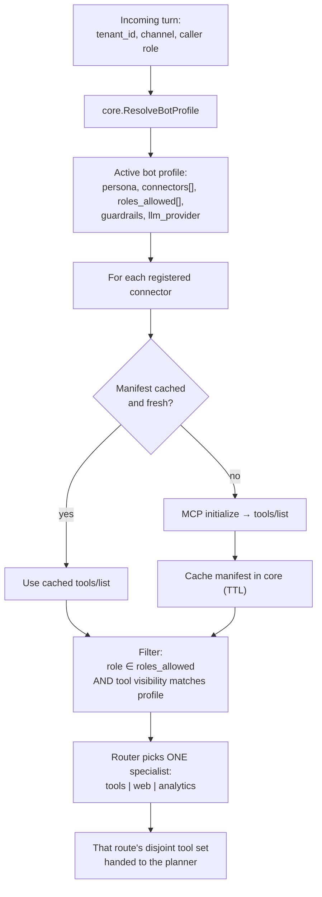

Three properties fall out of this that a static design cannot have:

1. **Two tenants on the same orchestrator process have completely different capabilities.**
   No per-tenant deployment, no feature flags.
2. **A tenant adding a tool changes their bot's behaviour without a Weave deploy.**
   Register it; the next manifest refresh picks it up.
3. **A dead connector degrades one turn, not the platform.** A connector that times out is
   dropped from that turn's tool set with a trace event — not a hard request failure, and
   never another tenant's problem.

### Tool descriptions are load-bearing, not metadata

This is a subtle point that trips people up. A tool's `description` is not documentation
for humans — it is the *only* thing the planner uses to decide whether and how to call it,
and it travels **with the tool's result** back into the model's context so the model can
interpret what it got.

Weave therefore treats a missing description as a **registration-time validation failure**,
not a warning: `core` refuses to cache a connector manifest containing an undescribed tool.
A connector is only "active" once every tool it exposes is fully described.

## 7. MCP, and why that bet

**Model Context Protocol (MCP)** is an open protocol for exposing tools and resources to an
LLM application. Its relevant shape:

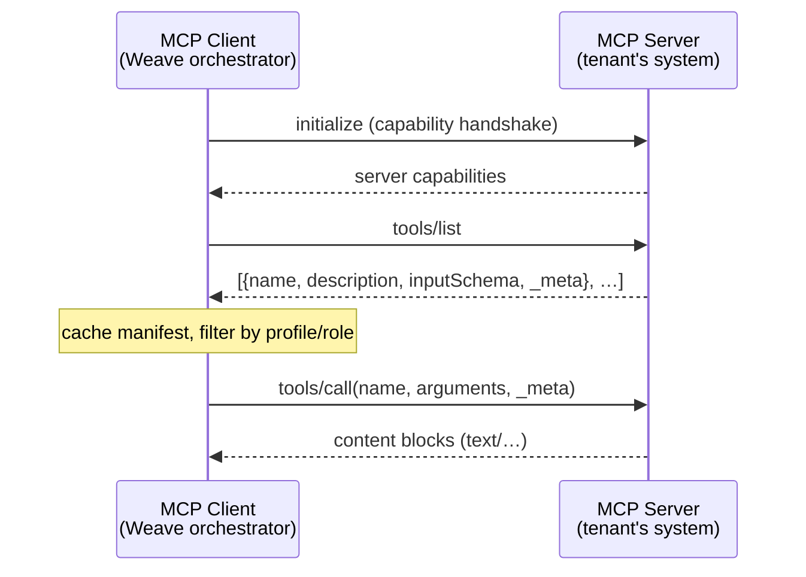

**Why bet on it:**

| Reason | Detail |
|---|---|
| It's the integration surface, standardised | A tenant already running an MCP server is connected with zero new code |
| It has an escape hatch built in | MCP's `_meta` field carries Weave-specific extensions (`visibility`, `category`, the per-user assertion) without forking the protocol |
| It keeps Weave honest | Weave is *just* an MCP client. Anything it can reach, another MCP client could too — no proprietary capture of the tenant's integration work |
| The ecosystem compounds | Every MCP server anyone builds is a potential Weave connector |

**Where Weave extends it, deliberately:** MCP's `Tool` schema has no concept of visibility.
Weave carries `visibility`/`category` in `_meta` on `tools/list`, and a signed user
assertion in `_meta` on `tools/call`. A third-party MCP server that sets neither is treated
as `visibility: "external"` — the least restrictive default, so a standards-compliant
server isn't silently hidden.

---
---

# Part III — Architecture

## 8. The service map

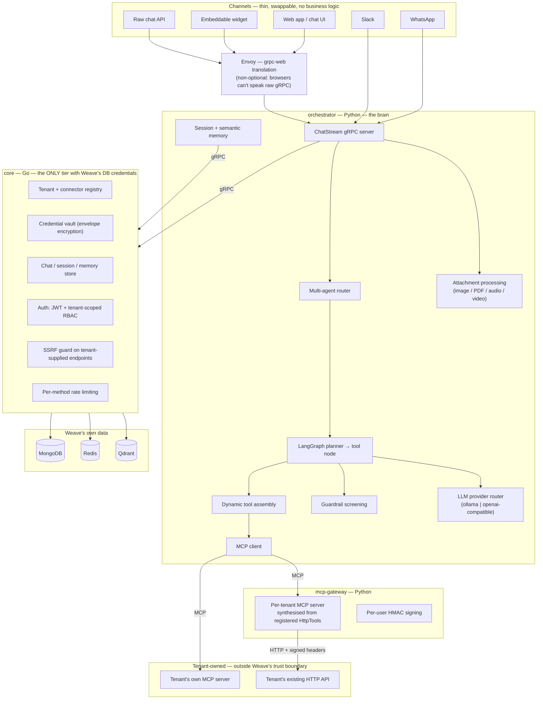

### Who owns what — and, crucially, what each tier never does

| Service | Language | Owns | **Never does** |
|---|---|---|---|
| `core` | Go | Tenant/connector registry, credential vault, chat/session/memory store, auth, rate limiting, SSRF guard | Never runs LLM inference; never calls a tenant's MCP server directly |
| `orchestrator` | Python | Chat gRPC server, router, LangGraph planner/agents, MCP client, tool assembly, attachments, guardrails, memory assembly | **Never holds a database connection** — every read/write goes through `core` |
| `mcp-gateway` | Python | Turns a tenant's registered `HttpTool`s into a real, per-tenant MCP server | Never hosts tenant business logic — it proxies to the tenant's own API |
| `web` | TypeScript | Chat UI, admin console, embeddable widget | Never talks to a database; grpc-web through Envoy only |
| `packages/weave-sdk` | Python | The tenant-facing registration/config client | **Never talks to chat** — channels call `orchestrator` directly |
| `connectors/` | mixed | Weave's *own* reference/scaffold MCP servers | Never contains a tenant's real business code |

That "never does" column is not documentation — it's the invariant set. If `orchestrator`
ever imports a Mongo driver, that's a defect, not a shortcut.

## 9. The request lifecycle

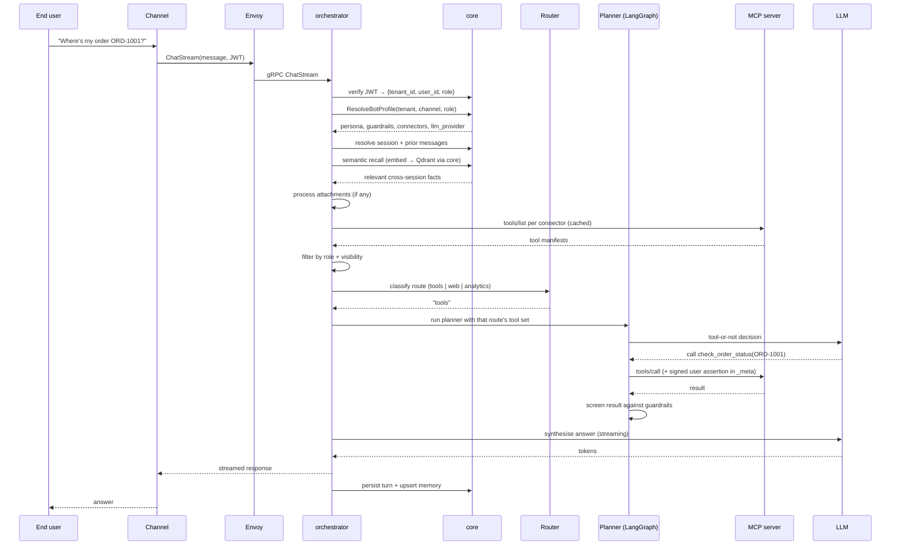

**The step that makes Weave different from a hardcoded agent** is the `tools/list` block:
tool availability is resolved *per request*, from the tenant's live registry — never
compiled in.

## 10. Dynamic tool assembly — the filters, in order

Three independent filters run before the model sees anything. They compose, and the order
matters: each is strictly safer than the one after it.

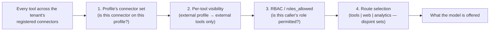

| Control | Field | Fails where | Why it's separate |
|---|---|---|---|
| Profile scope | `BotProfile.connector_ids` | Assembly | A tenant may run connectors a given bot shouldn't touch at all |
| Visibility | `HttpTool.visibility` (`internal`\|`external`) | Assembly | Structurally safer than guardrails: the tool is never *offered*, so it can't be called |
| RBAC | `BotProfile.roles_allowed` | Assembly | Role is tenant-scoped, verified from the JWT, never client-supplied |
| Route | Router classification | Pre-planner | Keeps the offered set small and intentional; no LLM call at all when only one route is possible |
| Guardrails | `BotProfile.guardrails` | Post-call + pre-send | Last line: what the bot may *say* about tools it legitimately called |

**The distinction to internalise:** *visibility* decides what a bot can **see**; *guardrails*
decide what it can **say**. A business with genuinely sensitive systems marks those tools
`internal` rather than trusting a guardrail to catch a disclosure after the fact.

## 11. The data model

Weave's MongoDB holds only *platform* data. There is no tenant business table, by design.

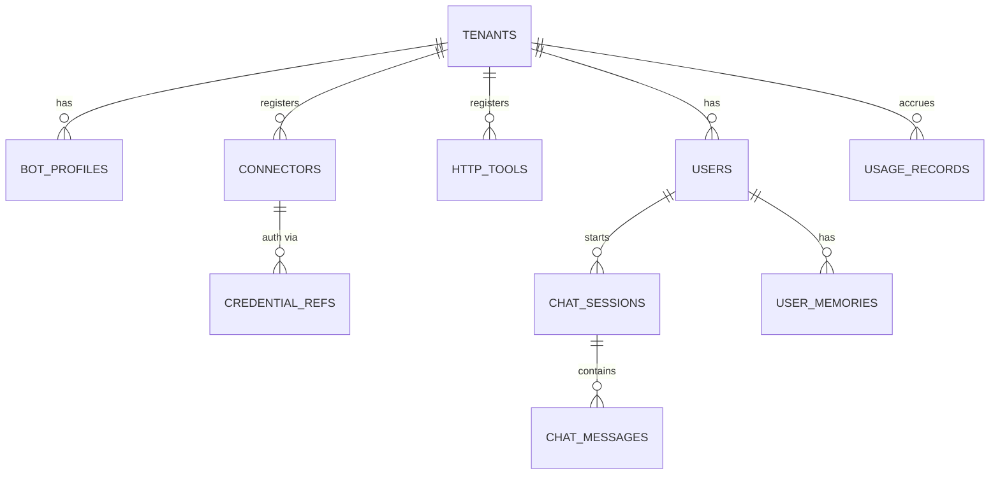

Representative documents:

```jsonc
// connectors — a tenant's own MCP server
{ "_id": "conn_01H…", "tenant_id": "acme-clinic", "name": "acme-booking-mcp",
  "transport": "http+sse", "endpoint": "https://acme.example.com/mcp",
  "credential_ref": "cred_01H…",
  "capability_manifest": { /* cached tools/list */ },
  "manifest_refreshed_at": "2026-08-11T10:00:00Z", "status": "healthy" }

// bot_profiles — the unit a channel points at
{ "_id": "profile_01H…", "tenant_id": "acme-clinic", "name": "external",
  "persona": "You are Acme Clinic's booking assistant. Be warm and concise;
    never discuss another patient's appointments.",
  "guardrails": ["Never disclose a patient's diagnosis or medication."],
  "connector_ids": ["conn_01H…"],
  "channels": ["web-widget", "whatsapp"], "roles_allowed": ["customer"],
  "llm_provider": "openai", "llm_model": "gpt-4o-mini" }

// chat_messages — traceable back to the exact connector that answered
{ "_id": "msg_…", "tenant_id": "acme-clinic", "session_id": "ses_…",
  "role": "assistant", "content": "…",
  "tool_used": "check_order_status", "connector_used": "acme-booking-mcp",
  "created_at": "…" }
```

**Every collection carries `tenant_id` with a compound index, and every RPC enforces it
server-side** — never trusting a client-supplied value without cross-checking the
authenticated session.

## 12. Trust boundaries and the security model

Weave's central security constraint: **it orchestrates access to systems it does not own.**

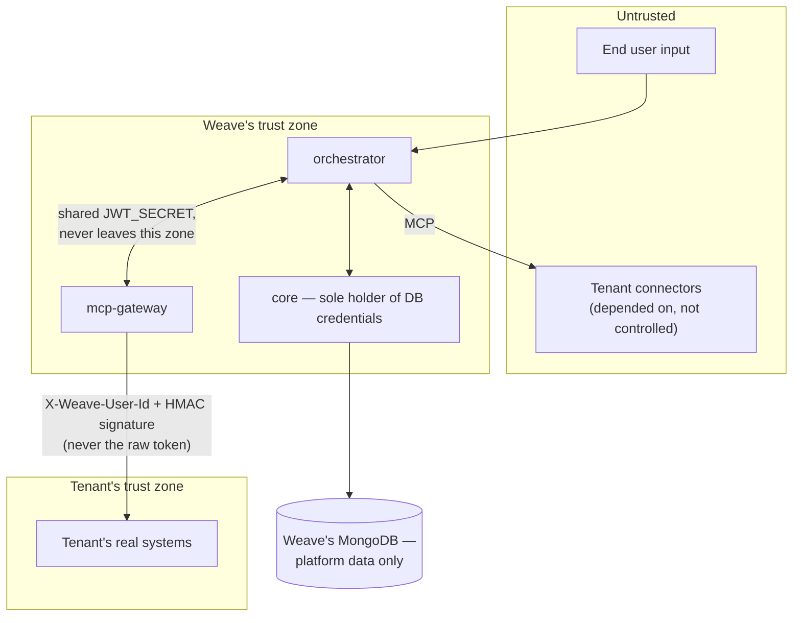

### The rules, and what each one is defending against

| Rule | Defends against |
|---|---|
| **The LLM never acts directly** — only ever calls a named, schema-validated, pre-registered tool | Prompt injection escalating into arbitrary requests or queries |
| **`core` is the only tier with DB credentials** | A compromised orchestrator reaching platform data directly |
| **Tenant data never enters Weave's DB** | A Weave breach leaking business records — there is no copy |
| **RBAC re-checked at the tool layer**, not just the edge | The model's *intent* to call a tool being mistaken for authorisation |
| **One Qdrant collection per tenant** (not a shared collection with a filter) | A filter bug leaking embeddings across tenants |
| **SSRF guard (`core/netguard`)** rejects loopback/RFC1918/link-local endpoints at registration | A tenant pointing a "connector" at cloud metadata (`169.254.169.254`) and having Weave fetch it as a trusted principal |
| **Rate limiting ahead of auth**, keyed on peer IP with the port stripped | Brute-force on `Login` (which has no token yet, so it must apply pre-auth) |
| **Envelope encryption for credentials** — per-credential AES-256 DEK, wrapped by a root key held only in memory | A leaked database dump being sufficient to reconstruct a usable tenant credential |
| **Short-lived (`60s`), distinct-`typ` user assertions** for per-user tools | An intercepted assertion being replayed as a real access token |
| **Guardrails fail closed** — an unparseable judge verdict counts as a violation | A screening failure silently becoming an allow |

### Per-end-user auth — the mechanism worth understanding in full

Some tenant endpoints must answer only for the *specific signed-in user* asking — a
finance app's "my own transactions". A tenant-wide API key cannot express that.

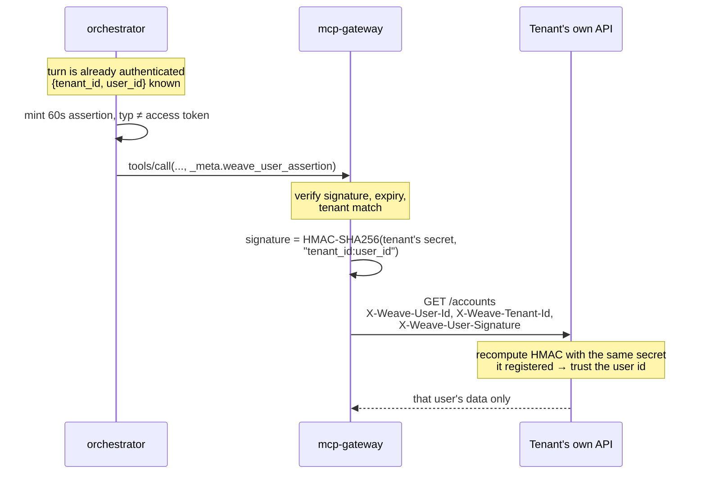

The tenant never sees Weave's internal `JWT_SECRET` — only a signature it can verify with
the secret *it* registered. This is the same webhook-signing pattern Stripe and GitHub use
for inbound verification, applied to an outbound tool call. Weave never needs to know how
the tenant maps Weave user IDs onto its own user records.

## 13. Memory and RAG

Two tiers, both written and read **only through `core`** — `orchestrator` never holds a
database connection, even for memory.

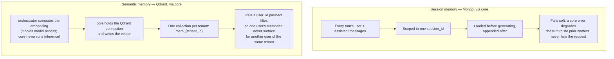

Note the **split of responsibility in the long-term tier**: inference belongs to
`orchestrator`, the datastore connection belongs to `core`. Neither tier can do the
other's job. That's the "core is the only tier with credentials" invariant holding even
where it's inconvenient.

## 14. Multimodal attachments

A turn can carry images, audio, video, and PDFs alongside its text
(`ChatStreamRequest.attachments`). Each is processed once, inline, and discarded —
orchestrator never stores them.

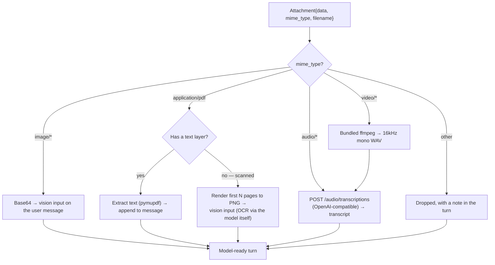

Two design choices worth calling out:

- **OCR without an OCR engine.** A scanned PDF's pages are rendered to images and handed
  to the bot profile's own vision-capable model, rather than adding a Tesseract
  dependency. Tradeoff: it reads as well as the configured model can see — and a
  text-only model gets the images but can't read them.
- **No system binaries required.** `pymupdf` (PDF text + rendering) and `imageio-ffmpeg`
  (a bundled static ffmpeg) are both self-contained wheels. A fresh checkout handles video
  with zero host setup.

**Per-provider translation** happens in the LLM clients, not the caller: an internal
`image_attachments` key becomes Ollama's `images` list or OpenAI's `image_url` content
parts, so `chat_service.py` stays provider-agnostic.

## 15. The design system, briefly

Weave's UI identity is the product thesis made visible. The signature component is **the
Weave Line**: a trace under each assistant turn showing the message's actual path —
`Channel → Planner → Agent → Connector → Response` — with segments that touch a *tenant's*
system rendered in the warm thread and Weave's own reasoning in the cool one.

That colour split isn't decoration: a user should always be able to tell, at a glance, when
the assistant is reaching into *their* system versus reasoning on its own. It's the
auditability principle from the security model, rendered in the UI. Full tokens, type
scale, and component rules are in [`../DESIGN.md`](../DESIGN.md).

---
---

# Part IV — Why these choices (the decision log)

This is the section to read before changing anything, and the section to have ready when
someone asks "why didn't you just…".

| # | Decision | Chosen | Rejected | Core reason |
|---|---|---|---|---|
| 16 | Platform data tier language | **Go** | Python everywhere | Static typing + performance on the tier that holds every credential and every tenant-scoping check |
| 17 | Orchestration language | **Python** | Go everywhere | The entire LLM/agent ecosystem (LangGraph, MCP SDK, embeddings) lives in Python |
| 18 | Inter-service contract | **gRPC + Protobuf** | REST/JSON | One typed contract, codegen for Go/Python/TS, native server-streaming for chat |
| 19 | Platform database | **MongoDB** | Postgres | Flexible per-tenant config/manifest shapes; the relational guarantees Weave needs are thin |
| 20 | Agent framework | **LangGraph** | Hand-rolled loop | Explicit state machine, checkpointing, and a real place to put the tool node and guardrail screen |
| 21 | Integration protocol | **MCP** | Bespoke plugin format | Open ecosystem; `_meta` gives an extension path without forking |
| 22 | Tenant onboarding path | **mcp-gateway hosts MCP for them** | Require every tenant to run an MCP server | Removes the single biggest onboarding barrier — while still speaking real MCP end-to-end |
| 23 | Credential storage | **App-level envelope encryption** | HashiCorp Vault / cloud KMS | Avoids an operational dependency before there's a real KMS relationship; callers only ever see a `credential_ref`, so migration stays open |
| 24 | Vector isolation | **One Qdrant collection per tenant** | Shared collection + filter | A filter bug leaks across tenants; a wrong collection name just fails |
| 25 | Guardrail judge | **LLM-as-judge, fail closed** | Keyword blocklist | "Never disclose supplier names" doesn't reduce to a string list |
| 26 | Guardrails + streaming | **Mutually exclusive by construction** | Stream and screen incrementally | A token already on the wire can't be recalled |
| 27 | LLM provider | **Per-profile router (`ollama` \| OpenAI-compatible)** | One hardcoded vendor | A tenant's model choice is a config value; adding a backend means adding a module, not touching callers |
| 28 | Browser transport | **Envoy grpc-web** | REST shim for the browser | Browsers can't speak raw gRPC, and a hand-maintained REST shim would drift from the proto contract |
| 29 | SDK scope | **Registration/config only** | SDK also wraps chat | Channels talk to `orchestrator` directly; keeping chat out of the SDK keeps one clear seam |
| 30 | Demo tenants | **External sibling repos** | `connectors/demo-*` inside this repo | A tenant's integration is *their* code in *their* codebase — the demos must prove exactly that |

### The decisions worth expanding

#### 16–17. Two languages, on purpose

The obvious criticism is that a two-language monorepo doubles tooling. The answer is that
the two tiers have genuinely different requirements: `core` is a credential-holding,
tenant-scoping, high-fan-in data tier where static typing and predictable performance pay
for themselves; `orchestrator` needs the Python AI ecosystem, full stop. The seam between
them is a typed proto contract, which is exactly where a language boundary should sit.

#### 21. MCP over a bespoke format

A bespoke plugin format would have been *easier* — no protocol handshake, no `_meta`
gymnastics. It would also have made every future integration Weave's own engineering
problem, and made every tenant's integration work worthless outside Weave. Betting on an
open protocol means the ecosystem's growth is Weave's growth, and a tenant's connector
remains theirs.

#### 22. mcp-gateway — removing the need to run a server

This is the single most important product simplification in the system, and it resolves
the honest objection from [§3](#3-why-not-something-else).

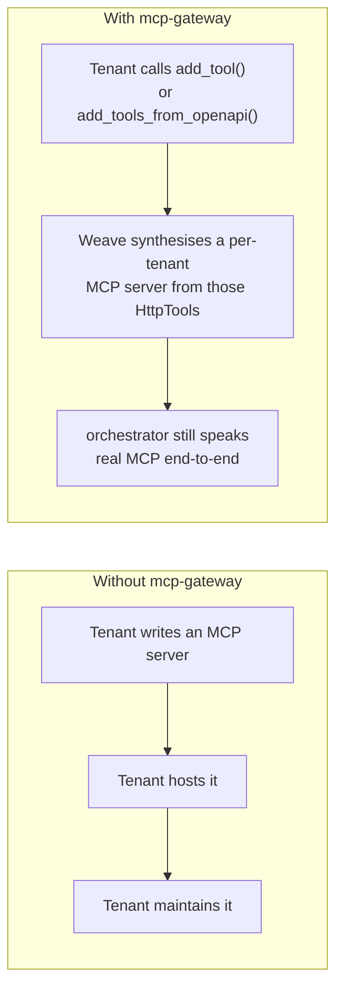

Note the deliberate constraint in `A3`: the gateway does not bypass MCP with an internal
shortcut. Every tool call is a real MCP call, so a tenant who later stands up their own
MCP server swaps in without changing anything upstream.

And for a business with a large existing surface, `add_tools_from_openapi()` registers a
*deliberate subset* of an OpenAPI spec in one call — `include`/`exclude` on `operationId`,
mutually exclusive so there's exactly one unambiguous reading of which subset was meant.
An unregistered endpoint is simply invisible to Weave, never partially exposed.

#### 26. Guardrails and streaming cannot coexist

A profile with active guardrails gets its answer generated in full, screened, then
delivered chunked (for a comparable UX). Profiles without guardrails get genuine
token-by-token streaming. This is a scope boundary, not an oversight — "fixing" it by
streaming guardrail-checked content incrementally reintroduces exactly the leak the
buffering exists to prevent.

**A known bluntness, documented rather than hidden:** screening operates on the whole tool
result, not per field. A result bundling sensitive and non-sensitive data gets redacted
*entirely*. Correct and safe (it fails toward less disclosure), but coarse. Field-level
redaction is real follow-up work.

---
---

# Part V — Build it from scratch

This part is the curriculum. It follows the **actual order the system was built in**
(`PLAN.md`), because that order is load-bearing: each phase's output is the next phase's
foundation, and building them out of order means building on air.

## 31. Prerequisite skills

You do not need all of this on day one — the phase table below says where each becomes
necessary.

| Skill area | Specifically | First needed | Why |
|---|---|---|---|
| **Protobuf / gRPC** | `buf`, service definitions, server streaming, interceptors | Phase 0 | Every service contract |
| **Go** | Idiomatic services, Mongo driver, `grpc-go`, interceptor chains | Phase 0 | All of `core` |
| **MongoDB** | Compound indexes, document modelling, tenant scoping | Phase 0 | Platform data |
| **Applied cryptography** | AES-256-GCM, envelope encryption, HMAC, constant-time compare | Phase 1 | Credential vault, per-user auth |
| **Network security** | SSRF, DNS rebinding, RFC1918/link-local ranges | Phase 1 | `netguard` |
| **Auth** | JWT claims/expiry, refresh rotation, RBAC scoping | Phase 2 | Auth domain |
| **Redis** | Fixed-window counters, `INCR`+`PEXPIRE`, fail-open design | Phase 2.x | Rate limiting |
| **Python async** | `asyncio`, async generators, `grpc.aio` | Phase 3 | All of `orchestrator` |
| **LLM fundamentals** | Function/tool calling, structured output, context assembly, streaming | Phase 3 | Planner and synthesis |
| **LangGraph** | State machines, nodes, conditional edges | Phase 3 | The turn graph |
| **MCP** | `initialize` → `tools/list` → `tools/call`, `_meta` | Phase 3 | The whole integration model |
| **Embeddings / vector search** | Dimensions, per-tenant collections, payload filters | Phase 3.8 | Semantic memory, RAG |
| **Next.js + TypeScript** | App Router, `connect-web`, generated clients | Phase 3.8 | `web` |
| **Kubernetes / containers** | Podman Compose locally, Deployments/Services/HPA | Phase 2.y | Deployment |
| **Observability** | OpenTelemetry spans, trace attribution | Throughout | Auditability |

## 32. The build order

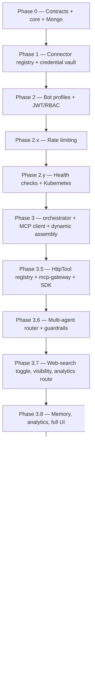

---

### Phase 0 — Contracts and the platform data tier

**Goal:** the spine. A real `protos/` contract, generated Go stubs, and a `core` service
writing to MongoDB. Nothing else touches the DB, ever again.

| Concepts to learn | What you build | Done when |
|---|---|---|
| Protobuf message/service design; `buf` workspace + codegen; Go gRPC servers; Mongo document modelling; tenant-scoped compound indexes; ULID ids | `protos/` tree, `buf.gen.yaml`, `core` service with a tenant domain, Mongo collections | You can `CreateTenant` over real gRPC and see the document in Mongo |

**The decision you're making here** is the one that constrains everything after it: *only*
`core` gets database credentials. Write that down as an invariant now, because every later
phase will be tempted to break it.

---

### Phase 1 — Connector registry and the credential vault

**Goal:** the mechanism that makes Weave plug-and-play — a tenant can register an MCP
connector and its credentials, safely.

| Concepts to learn | What you build | Done when |
|---|---|---|
| Envelope encryption (DEK wrapped by a root key); AES-256-GCM nonce handling; SSRF classes and IP range checks; MCP `tools/list` at the protocol level; manifest caching + TTL | `ConnectorService` (register/list/refresh/deregister), the vault, `netguard`, a minimal Go MCP client for manifest caching | Registering a connector caches its manifest; a loopback endpoint is rejected; a DB dump contains no usable secret |

**Subtlety worth internalising:** validate the tool-description requirement *here*, at
manifest-cache time. Rejecting an undescribed tool at registration is enormously cheaper
than debugging a planner that mysteriously won't call something.

---

### Phase 2 — Bot profiles and auth

**Goal:** named bot profiles per tenant, with JWT + RBAC wired through.

| Concepts to learn | What you build | Done when |
|---|---|---|
| JWT claims design (`{tenant_id, user_id, role, typ, iat, exp}`); refresh rotation; interceptor-based auth; **tenant-scoped** roles (never a bare global role) | `AuthService`, `BotProfileService`, a shared auth interceptor | A `customer` in tenant A cannot reach tenant B's profile, and the check lives in an interceptor, not in each handler |

---

### Phase 2.x — Rate limiting (cross-cutting)

**Goal:** every RPC has a DDoS/brute-force baseline, applied **ahead of** auth in the
interceptor chain.

| Concepts to learn | What you build | Done when |
|---|---|---|
| Fixed-window counters in Redis; per-method keying; why you key on peer IP **with the port stripped**; why you must not trust `x-forwarded-for`; fail-open reasoning | `packages/shared-ratelimit`, chained in `core/main.go` before the auth interceptor | Flooding `Login` (which carries no token) is limited; a Redis outage degrades to unprotected rather than down |

> **A real bug caught in live verification, worth learning from:** keying on the full
> `ip:port` silently disables the limit entirely — every new TCP connection gets a fresh
> ephemeral port, so every request looks like a new client.

---

### Phase 2.y — Health checks and Kubernetes

**Goal:** real health checks (not a static "always up") and `core` plus its dependencies
actually running on Kubernetes — the first step toward offering this as a service rather
than only ever running under Compose.

---

### Phase 3 — The orchestrator, the MCP client, and dynamic assembly

**Goal:** `orchestrator` exists, streams a real LLM response, and calls a real MCP
connector via dynamically assembled tools. This is the phase where Weave becomes Weave.

| Concepts to learn | What you build | Done when |
|---|---|---|
| `grpc.aio` server streaming; LangGraph state/nodes/conditional edges; tool-calling schemas; the full MCP client handshake; manifest caching + role filtering; "the orchestrator holds no DB connection" discipline | `ChatStream` server, `mcp_client/`, `tools/assembly.py`, `server/graph.py` | A real question routes through the planner, calls a real MCP tool, and streams a real answer — with tool availability resolved per request |

**Design note that saves a later rewrite:** the graph decides *whether* a tool is needed
and runs it; it does **not** generate the user-visible answer. Synthesis is a single
separate streaming call over whatever message list the graph settles on. Otherwise you pay
for the same answer twice and get subtly different text.

---

### Phase 3.5 — HttpTool registry, mcp-gateway, and the SDK

**Goal:** the product simplification. A business attaches an existing public HTTP API as a
bot tool via `import weave`, without writing or hosting any MCP server.

| Concepts to learn | What you build | Done when |
|---|---|---|
| Synthesising an MCP server at runtime from a registry; path-parameter substitution; JSON-schema generation; SDK ergonomics; keeping an SDK dependency-free enough to install anywhere | `HttpToolService` in `core`, `mcp-gateway`, `packages/weave-sdk` | A tenant registers an endpoint with `add_tool()` and the bot calls it — **over real MCP**, not an internal shortcut |

---

### Phase 3.6 — Multi-agent router and guardrails

**Goal:** route each turn to the right specialist instead of offering every tool at once,
and let a business declare an external bot with rules that are *enforced*, not just
prompted.

| Concepts to learn | What you build | Done when |
|---|---|---|
| Lightweight intent classification; disjoint tool sets per route; LLM-as-judge; fail-closed verdict handling; two-checkpoint screening (tool result **and** final answer) | `server/router.py`, `server/guardrails.py`, screening in `_tool_node` | A guardrail violation is caught at the tool-result stage, before it ever enters the model's context |

**Efficiency detail:** if only one route is possible this turn, skip the classifier LLM
call entirely. Don't pay for a decision with one option.

---

### Phase 3.7 — Visibility, web-search opt-in, real analytics routing

| Concepts to learn | What you build | Done when |
|---|---|---|
| Carrying non-standard metadata through a standard protocol (`_meta`); safe defaults for third-party servers; opt-in leak surfaces | `HttpTool.visibility`, `HttpTool.category`, `BotProfile.web_search_enabled` (default `false`) | One tool registry serves both a customer bot and a staff bot, with no second connector |

**Why web search defaults off:** routing a turn to the web agent sends the user's raw
message to a public search engine — outside the trust boundary entirely. That's a decision
a business makes explicitly, not a convenience they discover later.

---

### Phase 3.8 — Memory, analytics, and the full UI

| Concepts to learn | What you build | Done when |
|---|---|---|
| Session vs semantic memory; embedding dimensions matching the store; per-tenant collections + payload filters; fail-soft memory; Next.js App Router; grpc-web via Envoy; generated TS clients | `session_memory.py`, `semantic_memory.py`, `core.MemoryService`, the `web` chat + admin console | A multi-turn conversation has real context, and facts recalled across *separate* sessions surface correctly — for the right user only |

---

### Phase 3.9 — Demo tenants as external repositories

**Goal:** demonstrate how Weave is *actually* used — a business's own team, in their own
separate codebase, installs the SDK and connects their existing systems.

**Zero demo-tenant business code lives in the platform repo**, not even under
`connectors/`. Two reference integrations exist as independent sibling repos:
`tarang-electronics` (B2C retail) and `suvidha-finserve` (B2B professional services).
Details in [`guides/DEMO_TENANTS.md`](guides/DEMO_TENANTS.md).

This phase is as much an architectural statement as a demo: if the demos could only work
*inside* the repo, the SDK wasn't really standalone.

---

### Phase 3.10 — Per-tenant persona/model, bulk registration, a genuinely standalone SDK

Three gaps found by actually demonstrating the previous phase — the pattern worth learning
is that *live demonstration finds what tests don't*:

| Gap found | Fix |
|---|---|
| `BotProfile.persona` was stored but never read — every profile silently got the same hardcoded prompt | `_build_system_prompt` uses the profile's persona as the base prompt |
| A business with 70 endpoints had no way to register 40 without 40 calls | `add_tools_from_openapi()` with mutually exclusive `include`/`exclude` |
| The LLM backend was hardcoded to Ollama | `llm/router.py` resolving `BotProfile.llm_provider` to a module |
| The SDK depended on an internal package, so it was never *actually* installable standalone | SDK bundles its own generated stubs |

---

### Phase 3.11 — Per-end-user auth

**Goal:** a tenant with APIs that must answer only for the specific signed-in user asking.

| Concepts to learn | What you build | Done when |
|---|---|---|
| Short-lived narrow assertions with a distinct `typ`; HMAC request signing; the webhook-verification pattern; why you never forward the caller's real token | `mint_user_assertion`, `gateway/user_assertion.py`, `gateway/http_signing.py`, `HttpTool.auth_mode` | A tenant endpoint can prove *which* user is asking, using only a secret it registered itself |

`core` rejects registering a `user_token` tool with no `credential_secret` at write time —
there'd be nothing to sign with, so it would fail silently on first call otherwise.

---

### Phase 3.12 — Multimodal attachments

| Concepts to learn | What you build | Done when |
|---|---|---|
| Proto evolution (adding a repeated field compatibly); per-provider multimodal wire formats; PDF text layers vs scans; audio transcription APIs; bundling binaries via wheels instead of host installs; Windows temp-file/subprocess handle semantics | `Attachment` in the proto, `orchestrator/attachments/`, per-provider translation in both LLM clients | An image, a scanned PDF, a voice note, and a video clip all reach the model as usable context |

---

### Phase 4+ — Not yet built

`channels/` (thin per-channel adapters), `packs/` (vertical starter templates), and
`compute/` (platform-generic modules like reranking) are designed but not built. Treating
an empty directory as documentation of intent would be dishonest — see `PLAN.md`.

## 33. Local development topology

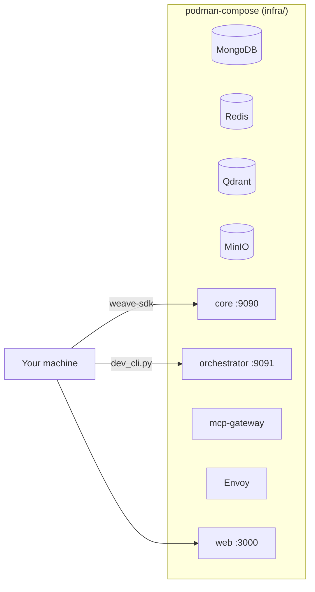

Two ways in while developing: the `web` chat UI through Envoy, or `orchestrator/dev_cli.py`
straight at the `ChatStream` RPC — which is the same RPC a real channel calls, so verifying
there is verifying the real path.

---
---

# Part VI — Status, honest gaps, and roadmap

## 34. What's actually true today

| Area | Status |
|---|---|
| Dynamic tool assembly, per-request | ✅ Built, live-verified |
| Per-bot-profile persona / guardrails / LLM provider | ✅ Built, live-verified |
| Per-tool visibility and category | ✅ Built |
| Per-end-user auth (`user_token` + HMAC) | ✅ Built |
| Session + cross-session semantic memory | ✅ Built |
| Multimodal attachments (image/PDF/audio/video, OCR fallback) | ✅ Built, tested |
| Web chat UI + admin console | ✅ Built |
| Credential vault (envelope encryption) | ✅ Mechanism built |
| Credential **rotation** + per-access auditing | ❌ Gap — before any real tenant credential |
| Service-to-service auth (mTLS) | ❌ Gap |
| Tenant-supplied LLM credentials | ❌ Not built — provider keys are orchestrator's own config |
| Field-level guardrail redaction | ❌ Gap — screening is whole-result today |
| Rate limiting behind a real proxy | ⚠️ Needs verified client IP forwarding (PROXY protocol) |
| RAG ingestion pipeline | ❌ Not built |
| `channels/`, `packs/`, `compute/` | ❌ Designed, not built |
| Published package / license | ❌ `weave-sdk` is a path dependency; no license chosen |

## 35. What that means for deployment

Deploy for **internal testing** today (Podman Compose locally, or a staging cluster).
Do **not** put a real non-dev tenant's data behind it until at least credential rotation,
service-to-service auth, and the proxy client-IP issue are closed — that's the repo's own
position, not a conservative reading of it.

---
---

# Part VII — Pitching it

## 36. The 60-second version

> Every business wants an AI assistant over the systems it already runs. Today they either
> import their data into someone else's platform — which is a non-starter for anyone
> regulated — or they spend a year building the same agent scaffolding everyone else is
> building.
>
> Weave inverts it. Your systems stay exactly where they are. You register them as
> connectors — or just point Weave at your existing API — define a bot profile, and deploy
> it to a widget, WhatsApp, Slack, or an API. Weave does the reasoning: a planner,
> specialist agents, per-request tool assembly, memory, guardrails, every hop traced.
>
> Your data never enters our database. There's nothing for us to leak, nothing to migrate
> off, and the same platform serves a hospital chain and one person's personal inbox
> without special-casing either.

## 37. The demo that lands

1. **Show the tenant's own repo** — a real API, and `onboard.py` narrating the six steps.
   Emphasise: this is *their* codebase, not ours.
2. **Run onboarding live.** Tools registered, two bot profiles created — customer-facing
   and staff-facing.
3. **Ask the customer bot a staff question.** It can't see the tool. Not "refuses to
   answer" — *cannot see it*. That distinction is the pitch.
4. **Ask the staff bot the same thing.** Full answer, with the connector that served it
   named in the trace.
5. **Add a tool and re-ask** without redeploying anything.

Step 3 is the moment the architecture becomes legible to a non-engineer.

## 38. The hard questions

| Question | Answer |
|---|---|
| *"What if the model hallucinates a tool call?"* | It's rejected at the tool node — the name isn't in the assembled set — and the model is told so plainly. It cannot invent an endpoint. |
| *"What if a tenant's connector is malicious?"* | Worst case it corrupts that tenant's own conversation. Cross-tenant isolation is structural (tenant-scoped resolution), not a matter of trusting connector behaviour. |
| *"Who sees our data?"* | Weave sees a tool call and its result **in transit**, and traces it. There's no independent copy in Weave's database. |
| *"What's your moat if MCP is open?"* | The moat isn't the protocol — it's everything around it: multi-tenancy, credential handling, per-request assembly, per-role visibility, guardrails, memory, channels, auditability. MCP being open is why the integration surface grows without us. |
| *"Why would we not just use the LLM vendor's assistant API?"* | You'd still build orchestration, tenant isolation, per-role tool visibility, guardrails, memory, channels, and a UI. That's the product. |
| *"Is it production-ready?"* | No — and here's the gap list. (See [§34](#34-whats-actually-true-today). Answering this honestly is worth more than answering it well.) |

---
---

# Appendix

## A. Glossary

| Term | Meaning |
|---|---|
| **Bot profile** | A named configuration under a tenant: persona, connectors, channels, roles, guardrails, LLM choice |
| **Channel** | A thin adapter between a channel-native message and the chat API |
| **Connector** | An MCP server exposing a tenant's tools; outside Weave's trust boundary |
| **DEK** | Data encryption key — per-credential AES-256 key, itself wrapped by the root key |
| **Dynamic tool assembly** | Resolving the available tool set per request from live connector manifests |
| **Guardrails** | Free-text disclosure rules, LLM-judged, enforced for external profiles only |
| **HttpTool** | A tenant's HTTP endpoint registered via the SDK; served to the orchestrator as MCP by `mcp-gateway` |
| **MCP** | Model Context Protocol — the open tool/resource protocol Weave speaks as a client |
| **Manifest** | A connector's cached `tools/list` response |
| **Tenant** | A business or individual; the isolation boundary for everything |
| **User assertion** | A short-lived, distinct-`typ` `{tenant_id, user_id}` JWT used only for per-user tool auth |
| **Visibility** | Whether a tool is offered to external (customer-facing) profiles at all |
| **Weave Line** | The UI trace showing a message's real path, colour-split between Weave's reasoning and the tenant's systems |

## B. Repository map

```
weave/
├── core/           Go — the only tier with Weave's DB credentials
├── orchestrator/   Python — chat server, LangGraph, MCP client, tool assembly,
│                   attachments, guardrails, memory
├── mcp-gateway/    Python — synthesises a per-tenant MCP server from HttpTools
├── connectors/     Weave's own reference/scaffold MCP servers (never tenant code)
├── web/            Next.js — chat UI, admin console, widget
├── packages/       weave-sdk (tenant-facing) + shared-auth/clients/ratelimit (internal)
├── protos/         Every service contract
├── infra/          Podman Compose (local) + Kubernetes (cluster)
└── docs/
    ├── architecture/  ARCHITECTURE.md, SECURITY.md
    ├── guides/        ONBOARDING.md, DEMO_TENANTS.md
    └── WEAVE_FROM_SCRATCH.md   ← you are here
```

## C. Where to go next

| You want to… | Read |
|---|---|
| Configure a tenant | [`guides/ONBOARDING.md`](guides/ONBOARDING.md) |
| See two worked integrations | [`guides/DEMO_TENANTS.md`](guides/DEMO_TENANTS.md) |
| Go deeper on the request path | [`architecture/ARCHITECTURE.md`](architecture/ARCHITECTURE.md) |
| Go deeper on the trust model | [`architecture/SECURITY.md`](architecture/SECURITY.md) |
| See the phase-by-phase record with verification notes | [`../PLAN.md`](../PLAN.md) |
| See the visual identity | [`../DESIGN.md`](../DESIGN.md) |
