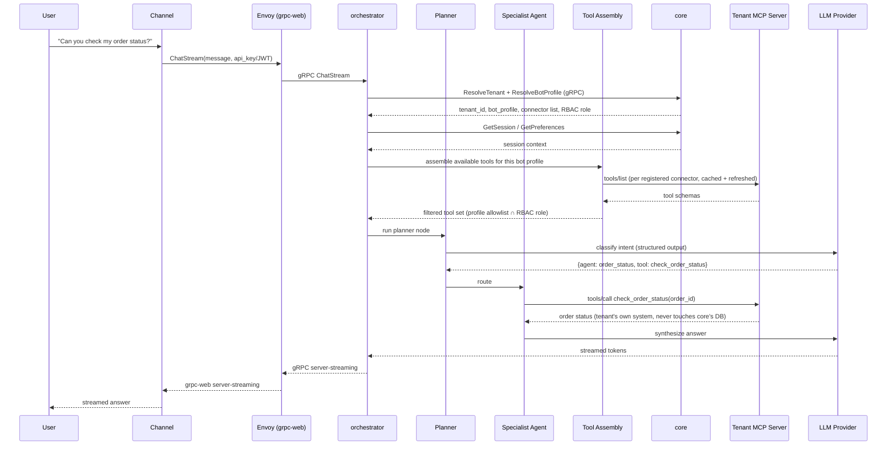
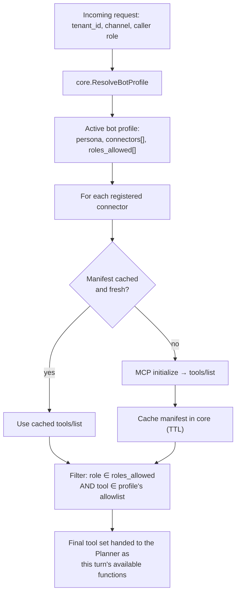
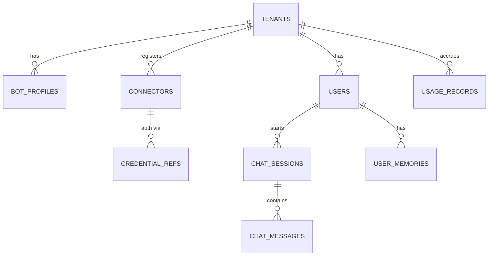

# Weave — System Architecture

Companion to `OVERVIEW.md` (the what/why) and `SECURITY.md` (the trust model). This doc is the how: request lifecycle, data model, and the mechanics of dynamic tool assembly.

---

## 1. Services

| Service | Language | Owns | Never does |
|---|---|---|---|
| `core` | Go | Tenant registry, connector registry, credential vault, chat/session/memory store, auth, billing/usage | Never runs LLM inference, never calls a tenant's MCP server directly |
| `orchestrator` | Python | Chat gRPC server (streaming), LangGraph planner + specialist agents, MCP client, dynamic tool assembly, RAG pipeline, memory assembly | Never holds a database connection — every read/write goes through `core` |
| `compute` | Python | Platform-generic compute modules (RAG reranking, faithfulness scoring) reached via routes on one server | Never hosts tenant-specific business logic — that belongs in a tenant's own connector |
| `connectors` (repo folder) | mixed | Reference/example MCP servers, connector scaffolding templates | Not deployed as part of the platform itself — these are examples and starter kits for tenants |
| `channels` | mixed | Thin per-channel translation to/from the chat API | Never contains business logic, tool definitions, or tenant awareness beyond resolving `tenant_id` |
| `web` | TypeScript | Onboarding dashboard, connector management UI, admin console, chat UI, embeddable widget | Never talks to a database directly — grpc-web through Envoy to `orchestrator`/`core` |

---

## 2. Request lifecycle



The step that differs fundamentally from a hardcoded-tool-catalog design: **tool assembly happens per request**, not at deploy time. `orchestrator` never ships knowing "tenant X has a `check_order_status` tool" — it discovers that by calling `tools/list` on whatever connectors that tenant's active bot profile has registered, caches the manifest, and refreshes it periodically or on a registry-change event.

---

## 3. Dynamic tool assembly



Failure handling: a connector that's down or times out is dropped from the tool set for that turn (with a trace event), not treated as a hard failure of the whole request — one tenant's misbehaving connector never blocks their other connectors or any other tenant.

**Tool descriptions are mandatory, not optional metadata.** A tool name and JSON schema alone are not enough context for the planner/agent to use a tool correctly or interpret its result — the description is load-bearing, not decorative:

- **At registration/manifest-refresh time** (`core`): every tool returned by a connector's `tools/list` must carry a non-empty `description`. `core` rejects caching a manifest that has a tool missing one — a connector is only "active" once every tool it exposes is fully described. This is enforced in code today by `core/mcpclient.ListTools` / `RefreshManifest` (Phase 1).
- **At tool-call time** (`orchestrator`, Phase 3 — not yet built): a tool's cached description travels alongside its `tools/call` result when handed back to the agent/LLM, not just the raw result payload. The model reasons about a tool's output in light of what the tool claims to do, so the description is part of the result's context, every time — never dropped after the initial planning step. **Tracked as an explicit Phase 3 definition-of-done item in `PLAN.md`.**
- **For tenants/SDK integrators**: whoever stands up a connector (hand-written MCP server, or scaffolded via the future `connector-sdk`) is responsible for writing a complete, accurate description for every tool and resource they expose — not just a name. `core` treats a missing description as a registration-time validation failure, not a warning, precisely so this can't be skipped by an integrator in a hurry.

**Multi-agent supervisor** (built in Phase 3.6, `orchestrator/server/router.py`): before tool assembly's filtered set is offered to the planner, a lightweight classification step decides which specialist agent handles the turn — a **tools agent** (the tenant's own registered connectors/`HttpTool`s, exactly as described above) or a **web agent** (a built-in public web-search tool, no tenant data involved, no API key required). Each route offers a disjoint tool set for that turn, not a merged one. "Analytics" is a routing category today, not a distinct capability — it's an explicit alias for the tools route, since there's no separate analytics data source in this system yet; the alias is deliberate and documented (`PLAN.md`'s Phase 3.6 notes), not a gap silently papered over.

---

## 4. Data model (owned by `core`)

Weave's own MongoDB holds only platform data — never a tenant's business records.



Representative documents (`_id` is a string ULID):

```jsonc
// connectors
{ "_id": "conn_01H…", "tenant_id": "acme-clinic", "name": "acme-booking-mcp",
  "transport": "http+sse", "endpoint": "https://acme.example.com/mcp",
  "credential_ref": "cred_01H…", "capability_manifest": { /* cached tools/list */ },
  "manifest_refreshed_at": "2026-08-11T10:00:00Z", "status": "healthy" }

// bot_profiles
{ "_id": "profile_01H…", "tenant_id": "acme-clinic", "name": "external",
  "persona_ref": "personas/external.md", "connector_ids": ["conn_01H…"],
  "channels": ["web-widget", "whatsapp"], "roles_allowed": ["customer"] }

// chat_messages
{ "_id": "msg_…", "tenant_id": "acme-clinic", "session_id": "ses_…",
  "role": "assistant", "content": "…", "tool_calls": [ /* structured, incl. which connector */ ],
  "created_at": "…" }
```

Every collection is tenant-scoped (`tenant_id` field + compound index), same as the trust-boundary rule below.

---

## 5. RAG and memory

- **RAG sources are pluralized.** A tenant's knowledge base can be Weave-hosted documents *or* MCP resources exposed by their own systems (a wiki, a doc store) — the ingestion pipeline pulls from either, chunks, embeds, and writes to a **per-tenant Qdrant collection**.
- **Memory** follows the same short-term (Redis, session-scoped) / long-term (Mongo + Qdrant semantic recall) split as the request lifecycle above — written and read only through `core`'s chat RPCs, never directly by `orchestrator`.

---

## 6. Observability

Every planner decision, tool call, and MCP round trip is a traced span (Langfuse), tagged with `tenant_id`, `bot_profile`, `session_id`, and — critically — which **connector** served a given tool call, so a tenant's own MCP server's latency/errors are visible and attributable, not blended into Weave's own service metrics. OpenTelemetry covers infra-level RPC latency/error rate across `core`, `orchestrator`, and `compute`.

---

## 7. Deployment

Local: Podman Compose brings up Mongo, Redis, Qdrant, MinIO, Envoy, `core`, `orchestrator`, `compute`, and `web`. Production: Kubernetes, one Deployment + Service per service, HPA on `orchestrator` and `core` at minimum. Tenant-owned MCP servers are **never** deployed by Weave's own infrastructure — they live wherever the tenant hosts them, reached over the network like any external API.
