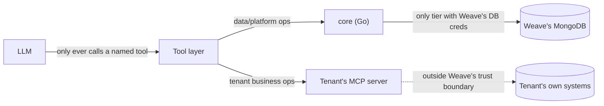

# Weave — Security Protocols

Weave's core design constraint: **it orchestrates access to systems it does not own.** Every rule below follows from taking that seriously — a tenant connecting their real business systems (or an individual connecting personal accounts) has to be able to trust the boundary between "Weave reasons about my data" and "Weave holds my data."

---

## 1. Trust boundaries

1. **The LLM never acts directly.** It only ever calls a typed, schema-validated tool. It cannot construct a query, pick an endpoint, or emit a raw MCP call itself.
2. **`core` is the only tier holding Weave's own database credentials**, and it only ever holds *platform* data (tenant/connector registry, credential vault, chat history, auth, billing). If any other service imports a Mongo driver, that's a defect.
3. **Tenant data never enters Weave's database.** A connector call goes `orchestrator → MCP client → tenant's MCP server`. Weave sees the tool call and its result in transit (and traces it), but has no independent copy of the tenant's underlying system.
4. **RBAC is re-checked at the tool layer, not just at the edge.** A caller's JWT establishes identity and role; the tool layer independently verifies the caller is allowed to invoke a given tool for the active bot profile before making the MCP call — the LLM's intent to call a tool is never sufficient authorization.

---

## 2. Tenant isolation

- Every platform-data collection in `core`'s MongoDB carries a `tenant_id` field with a compound index; every RPC requires and enforces `tenant_id` server-side (never trusts a client-supplied value without cross-checking the authenticated session).
- Qdrant uses **one collection per tenant** for RAG and semantic memory — stronger isolation than a shared collection with a filter, at the cost of more collections to manage; deliberate tradeoff given the sensitivity of what gets embedded.
- A connector registered by tenant A is never reachable by a request resolved to tenant B — the registry lookup is always scoped by the authenticated tenant, not by connector ID alone.
- Rate limits and usage/cost tracking are per-tenant at the edge so one tenant's traffic spike (or a slow/misbehaving connector) can't degrade another's experience.
- **Isolation test (required before any multi-tenant milestone ships):** seed two tenants with connectors that would return colliding data if scoping broke, confirm a request resolved to tenant A never sees tenant B's connector, bot profile, or RAG/memory result.

---

## 3. Credential vault

Tenant connectors need credentials (API keys, OAuth tokens) stored somewhere. This is new relative to a hardcoded-tool design and is treated as its own hardened subsystem, not a field on a Mongo document.

**Requirements:**
- Credentials are **never stored in plaintext** in `core`'s general-purpose MongoDB collections.
- Whichever approach is chosen: credentials are scoped to exactly the connector they authenticate, rotated on a defined schedule, revocable immediately on tenant request, and every access is an audited event (who/what/when), not just a successful decrypt.
- A leaked Weave database dump must **not** be sufficient to reconstruct a usable tenant credential.

**Decision (Phase 1): app-level envelope encryption.**

Rejected external vault (HashiCorp Vault / cloud KMS) for now because it adds a new operational dependency to a local-first `podman-compose` stack before Weave has a real KMS relationship in any environment, and Phase 1's scope doesn't need lease-based short-lived access yet — that's a real gap to revisit once there are production tenants (see below). Envelope encryption keeps the credential model self-contained in `core` and doesn't foreclose migrating to an external vault later, since callers only ever see a `credential_ref`, never the encryption scheme.

Shape:
- Each `CredentialRef` document stores a per-credential **data key (DEK)**: a random 32-byte AES-256 key, generated at credential-creation time, itself encrypted ("wrapped") with a single **root key** using AES-256-GCM.
- The plaintext secret (API key, OAuth token, etc.) is encrypted with the DEK (AES-256-GCM), and only the ciphertext + wrapped DEK + nonces are stored in Mongo — the DEK is never persisted unwrapped and the root key never touches the database.
- The root key is supplied to `core` via `VAULT_ROOT_KEY` (32 raw bytes, base64-encoded) at process start — env var locally, a real KMS-backed secret in any deployed environment. `core` holds it only in memory.
- Decryption happens only in-memory, at the point a credential is handed to an authorized caller (never logged, never returned in a `ListConnectors`-style response — only `RegisterConnector`'s initial response and a dedicated reveal path, once one exists, return plaintext).
- **Known gap, tracked for a later hardening pass**: rotation of the root key and per-credential access auditing are not yet implemented — Phase 1 ships the encryption mechanism and the "never plaintext at rest" guarantee, not the full operational lifecycle §3 requires. Revisit before any real (non-dev) tenant credential is stored.
- **A second, deliberately out-of-scope-so-far gap, same class**: `BotProfile.llm_provider`/`llm_model` (`ARCHITECTURE.md` §3) let a tenant pick *which* LLM backend `orchestrator` uses, but not supply their *own* credential for it — a non-default provider's API key (`OPENAI_API_KEY`) is `orchestrator`'s own process configuration, the same trust boundary as `OLLAMA_HOST`, shared across every tenant that selects that provider. A tenant who wants to use their own OpenAI account/key (rather than Weave's configured one) would need this vault extended to hold LLM-provider credentials the same way it holds connector credentials today — not built here, tracked alongside the gap above.

---

## 4. Connector (MCP) security

Since `orchestrator` makes outbound calls to arbitrary tenant-hosted MCP servers, it treats every connector as **untrusted infrastructure it depends on but does not control**:

- **Connection allowlisting**: a connector is only reachable if it's registered against the calling tenant — no ad hoc endpoint construction, ever.
- **Timeouts and circuit breaking**: a slow or hanging connector fails that tool call, not the whole turn or other tenants' traffic.
- **Response size limits**: a connector cannot return an unbounded payload into the LLM context or the trace store.
- **No cross-tenant blast radius**: a compromised or malicious connector belonging to tenant A can, at worst, corrupt tenant A's own conversation — it must not be able to read or affect tenant B's session, memory, or data. This is enforced structurally by tenant-scoped resolution (§2), not by trusting connector behavior.
- **Transport**: local/dev connectors may use stdio; anything reachable from a real tenant environment uses HTTP+SSE or Streamable HTTP with TLS — no unauthenticated plaintext connector endpoints in any non-local environment.
- **No "Database MCP."** Weave does not expose or consume a connector whose entire surface is raw query access — connectors are expected to expose narrow, purpose-built tools/resources, same discipline Weave holds itself to on the `core` side.
- **SSRF guard on every tenant-supplied endpoint** (`core/netguard`, added alongside the `HttpTool`/mcp-gateway subsystem): `RegisterConnector` and `RegisterHttpTool` both reject an endpoint whose host resolves to a loopback, RFC1918-private, link-local (which covers the `169.254.169.254` cloud metadata address), unspecified, or multicast address, before the endpoint is ever stored. This closes a real gap that existed from Phase 1 onward — `RegisterConnector` originally accepted any string at all, meaning a tenant could point a "connector" at internal infrastructure and have `core` (and transitively `orchestrator`/mcp-gateway) make that request on their behalf as a trusted internal principal. The block is secure by default and only skippable via `ALLOW_PRIVATE_ENDPOINTS=true`, which must never be set outside local dev (connectors legitimately running on loopback — `reference-mcp`, test fixtures).
- **Per-end-user auth for a tenant's own restricted APIs** (`HttpTool.auth_mode == "user_token"`, `ARCHITECTURE.md` §3's full mechanism): a business can mark specific tools as scoped to the calling end user, not just any authorized caller — e.g. a finance app's "my own transactions." The forwarded identity is never a raw copy of the caller's real access token: `orchestrator` mints a narrow, short-lived (`60s`), single-purpose `{tenant_id, user_id}` assertion — distinct `typ` claim, so it can never be replayed as a real access token even if intercepted — and `mcp-gateway` re-derives a per-tenant HMAC signature from it rather than forwarding the assertion (or `JWT_SECRET`) to the tenant at all. The tenant's own endpoint only ever sees `X-Weave-User-Id`/`X-Weave-Tenant-Id`/`X-Weave-User-Signature`, verifiable with the same shared secret they themselves registered — Weave's internal signing secret (`JWT_SECRET`) never leaves Weave's own trust zone (orchestrator ↔ mcp-gateway, the same zone `core` already sits in), consistent with the trust-boundary rule in §1.

---

## 5. Rate limiting & abuse defense

Every RPC on `core` is rate-limited — not just tenant-plan usage quotas (a business concern, not yet built), but a network-level defensive baseline against flooding, brute-force, and credential-stuffing attacks. Implemented in `packages/shared-ratelimit`, applied server-wide in `core/main.go` via `grpc.ChainUnaryInterceptor`, **ahead of** the auth interceptor in the chain — an attacker flooding `Login` has no token yet, so the limit has to apply regardless of auth state.

- **Fixed-window counter in Redis** (`INCR` + `PEXPIRE` on first hit), keyed per method so one endpoint's traffic can't exhaust another's budget.
- **Keyed by the raw gRPC peer IP** (source port stripped — every new TCP connection gets a fresh ephemeral port, so keying on the full `ip:port` silently disables the limit; this was a real bug caught in live verification, not design). Deliberately does **not** trust a client-supplied `x-forwarded-for` header — an attacker can rotate that value on every request and evade the limit entirely. **Known gap**: once `core` sits behind a real reverse proxy (the Envoy grpc-web proxy from `ARCHITECTURE.md`), every caller behind it shares the proxy's peer address unless the proxy is configured to forward a verified client IP over a trusted channel (e.g. PROXY protocol) — that's deployment infra, tracked as a follow-up, not solved by trusting an unverifiable header today.
- **Login/Register get the tightest limits** (5/min, 10/hour respectively) since they're the classic brute-force/spam target; everything else gets a generous default (120/min); health/reflection are exempt so infra healthchecks and `grpcurl` introspection keep working.
- **Fails open on a Redis outage** — rate limiting is defense in depth, not the only line of defense; a Redis blip degrading to "temporarily unprotected" is preferable to it taking `core` down entirely.
- Distinct from a future tenant-plan usage quota (e.g. "Acme Clinic's plan allows 10k requests/day"), which is a business rule keyed by `tenant_id` and layered on top once a caller's identity is resolved — this section is purely the DDoS/abuse defense baseline that applies to every caller, authenticated or not.

---

## 6. Auth

- **JWT**: short-lived access token + rotated refresh token, issued by `core`'s auth domain. Carried in gRPC metadata on every call.
- **RBAC roles are tenant-scoped**: a role check is always "role X within tenant Y," enforced by a shared interceptor — never a bare global role.
- **Bot-profile-level gating**: a bot profile's `roles_allowed` is an additional filter on top of RBAC — a `customer` role might be valid in the tenant but still barred from the `internal` bot profile entirely.
- **Channel-level auth varies by channel** (JWT for the web app, a scoped public key for an embeddable widget, a webhook signing secret for WhatsApp/Slack) but always resolves to the same `{tenant_id, role}` context before anything reaches the planner.

---

## 7. Guardrails (content disclosure)

`BotProfile.visibility` ("internal" | "external") + `BotProfile.guardrails` (free-text disclosure rules) — enforced only for external profiles, at two checkpoints in `orchestrator` (`server/graph.py`, `server/guardrails.py`): a tool's raw result before it enters the model's context, and the final answer before it's sent to the caller.

- **Streaming and hard guardrails are mutually exclusive, by construction.** A token already sent over the wire can't be recalled, so any profile with active guardrails gets its full answer generated non-streamed, screened, and only then sent (chunked, for a comparable UX — not real token-by-token generation). Profiles with no guardrails keep genuine streaming. This is a deliberate scope boundary, not an oversight — don't "fix" it by trying to stream guardrail-checked content incrementally; that reintroduces the exact leak the buffering exists to prevent.
- **The judge is the model itself (LLM-as-judge), not a keyword blocklist** — rules like "never disclose supplier names" don't reduce to a fixed string list. Fails **closed**: a judge-call error or an unparseable verdict is treated as a violation, never silently allowed through.
- **Known limitation, found in live verification, not hidden**: screening operates on the whole tool-result blob, not per-field. If a tool's result bundles sensitive and non-sensitive data together (e.g. one API response containing both order status and supplier name), a guardrail violation redacts the *entire* result, not just the offending part — even for a query that never asked about the sensitive field. Correct and safe (fails toward less disclosure, not more), but blunt. Field-level redaction (either LLM-directed partial redaction, or a connector/tool schema marking specific fields sensitive so mcp-gateway can strip them before returning) is a real follow-up, not built here.
- **Web search is an opt-in leak surface, not a neutral convenience.** `BotProfile.web_search_enabled` defaults to `false` — a business must explicitly turn it on, since routing a turn to the web agent (`server/web_search.py`) sends the user's raw message to a public search engine (DuckDuckGo), outside Weave's trust boundary entirely. The web agent's result still passes through the same tool-result guardrail screen as any other tool call (`server/graph.py`'s `_tool_node` doesn't distinguish web search from a registered `HttpTool`), and the final answer is screened same as always — but the outbound query itself (the user's message, verbatim) is never screened before being sent to DuckDuckGo, since screening exists to control what the bot *discloses*, not what a user *asks*.
- **Per-tool visibility is a separate, coarser control from guardrails, and comes first.** `HttpTool.visibility` (`"internal"|"external"`, `ARCHITECTURE.md` §3) decides whether an external bot profile can see a tool *at all* — guardrails then decide what an external profile can *say* about the tools it can see. A business with genuinely sensitive internal systems (customer PII, supplier pricing, inventory costs) should mark those tools `internal` rather than relying solely on a guardrail rule to keep an external bot from disclosing them; visibility fails at the tool-assembly stage (the tool is never offered to the model), which is strictly safer than trusting a guardrail's post-hoc screen of a tool the model was allowed to call in the first place.

---

## 8. Data protection

- Encryption in transit everywhere (TLS on every external hop; internal gRPC over the cluster network, mTLS as a hardening target once the platform has real tenants).
- Encryption at rest for MongoDB, Redis persistence, and MinIO.
- PII minimization: chat transcripts and memory facts are tenant/user-scoped and deletable on request (supports a real data-deletion flow, not just a soft flag).

---

## 9. Auditability

Every planner decision, tool call, and MCP round trip is a traced span (Langfuse/OpenTelemetry) tagged with `tenant_id`, `bot_profile`, `user_id`, and `connector_id` where applicable — a tenant (or Weave's own operators) can reconstruct exactly which connector served which answer, and when a credential was used.

---

## 10. Compliance posture (target, not yet achieved)

Before onboarding real business tenants with sensitive systems, this platform needs: a documented data-processing agreement model, data-residency options, SOC2-track controls, and a published `SECURITY.md`-equivalent vulnerability disclosure process for the hosted product (distinct from this design doc). Tracked as a pre-requisite for any paid/production tenant, not assumed to already be true.
