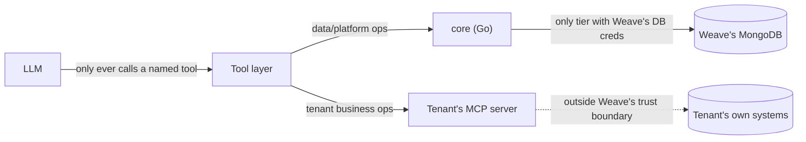

# Weave — Security Protocols

Weave's core design constraint: **it orchestrates access to systems it does not own.** Every rule below follows from taking that seriously — a tenant connecting their real business systems (or an individual connecting personal accounts) has to be able to trust the boundary between "Weave reasons about my data" and "Weave holds my data."

---

## 1. Trust boundaries

1. **The LLM never acts directly.** It only ever calls a typed, schema-validated tool. It cannot construct a query, pick an endpoint, or emit a raw MCP call itself.
2. **`core` is the only tier holding Weave's own database credentials**, and it only ever holds *platform* data (tenant/connector registry, credential vault, chat history, auth, billing). If any other service imports a Mongo driver, that's a defect.
3. **Tenant data never enters Weave's database.** A connector call goes `orchestrator → MCP client → tenant's MCP server`. Weave sees the tool call and its result in transit (and traces it), but has no independent copy of the tenant's underlying system.
4. **RBAC is re-checked at the tool layer, not just at the edge.** A caller's JWT establishes identity and role; the tool layer independently verifies the caller is allowed to invoke a given tool for the active bot profile before making the MCP call — the LLM's intent to call a tool is never sufficient authorization.

---

## 2. Tenant isolation

- Every platform-data collection in `core`'s MongoDB carries a `tenant_id` field with a compound index; every RPC requires and enforces `tenant_id` server-side (never trusts a client-supplied value without cross-checking the authenticated session).
- Qdrant uses **one collection per tenant** for RAG and semantic memory — stronger isolation than a shared collection with a filter, at the cost of more collections to manage; deliberate tradeoff given the sensitivity of what gets embedded.
- A connector registered by tenant A is never reachable by a request resolved to tenant B — the registry lookup is always scoped by the authenticated tenant, not by connector ID alone.
- Rate limits and usage/cost tracking are per-tenant at the edge so one tenant's traffic spike (or a slow/misbehaving connector) can't degrade another's experience.
- **Isolation test (required before any multi-tenant milestone ships):** seed two tenants with connectors that would return colliding data if scoping broke, confirm a request resolved to tenant A never sees tenant B's connector, bot profile, or RAG/memory result.

---

## 3. Credential vault

Tenant connectors need credentials (API keys, OAuth tokens) stored somewhere. This is new relative to a hardcoded-tool design and is treated as its own hardened subsystem, not a field on a Mongo document.

**Requirements, not yet a final design:**
- Credentials are **never stored in plaintext** in `core`'s general-purpose MongoDB collections.
- Two candidate approaches, to be decided with a dedicated design pass before any real tenant credential is stored:
  1. **External vault** (HashiCorp Vault, cloud KMS) — `core` stores only a reference (`credential_ref`), the vault holds the secret, access is short-lived and audited.
  2. **App-level envelope encryption** inside `core` — secrets encrypted with a per-tenant data key, itself wrapped by a root key held outside the database (KMS-backed), decrypted only in-memory at call time.
- Whichever approach is chosen: credentials are scoped to exactly the connector they authenticate, rotated on a defined schedule, revocable immediately on tenant request, and every access is an audited event (who/what/when), not just a successful decrypt.
- A leaked Weave database dump must **not** be sufficient to reconstruct a usable tenant credential.

---

## 4. Connector (MCP) security

Since `orchestrator` makes outbound calls to arbitrary tenant-hosted MCP servers, it treats every connector as **untrusted infrastructure it depends on but does not control**:

- **Connection allowlisting**: a connector is only reachable if it's registered against the calling tenant — no ad hoc endpoint construction, ever.
- **Timeouts and circuit breaking**: a slow or hanging connector fails that tool call, not the whole turn or other tenants' traffic.
- **Response size limits**: a connector cannot return an unbounded payload into the LLM context or the trace store.
- **No cross-tenant blast radius**: a compromised or malicious connector belonging to tenant A can, at worst, corrupt tenant A's own conversation — it must not be able to read or affect tenant B's session, memory, or data. This is enforced structurally by tenant-scoped resolution (§2), not by trusting connector behavior.
- **Transport**: local/dev connectors may use stdio; anything reachable from a real tenant environment uses HTTP+SSE or Streamable HTTP with TLS — no unauthenticated plaintext connector endpoints in any non-local environment.
- **No "Database MCP."** Weave does not expose or consume a connector whose entire surface is raw query access — connectors are expected to expose narrow, purpose-built tools/resources, same discipline Weave holds itself to on the `core` side.

---

## 5. Auth

- **JWT**: short-lived access token + rotated refresh token, issued by `core`'s auth domain. Carried in gRPC metadata on every call.
- **RBAC roles are tenant-scoped**: a role check is always "role X within tenant Y," enforced by a shared interceptor — never a bare global role.
- **Bot-profile-level gating**: a bot profile's `roles_allowed` is an additional filter on top of RBAC — a `customer` role might be valid in the tenant but still barred from the `internal` bot profile entirely.
- **Channel-level auth varies by channel** (JWT for the web app, a scoped public key for an embeddable widget, a webhook signing secret for WhatsApp/Slack) but always resolves to the same `{tenant_id, role}` context before anything reaches the planner.

---

## 6. Data protection

- Encryption in transit everywhere (TLS on every external hop; internal gRPC over the cluster network, mTLS as a hardening target once the platform has real tenants).
- Encryption at rest for MongoDB, Redis persistence, and MinIO.
- PII minimization: chat transcripts and memory facts are tenant/user-scoped and deletable on request (supports a real data-deletion flow, not just a soft flag).

---

## 7. Auditability

Every planner decision, tool call, and MCP round trip is a traced span (Langfuse/OpenTelemetry) tagged with `tenant_id`, `bot_profile`, `user_id`, and `connector_id` where applicable — a tenant (or Weave's own operators) can reconstruct exactly which connector served which answer, and when a credential was used.

---

## 8. Compliance posture (target, not yet achieved)

Before onboarding real business tenants with sensitive systems, this platform needs: a documented data-processing agreement model, data-residency options, SOC2-track controls, and a published `SECURITY.md`-equivalent vulnerability disclosure process for the hosted product (distinct from this design doc). Tracked as a pre-requisite for any paid/production tenant, not assumed to already be true.
