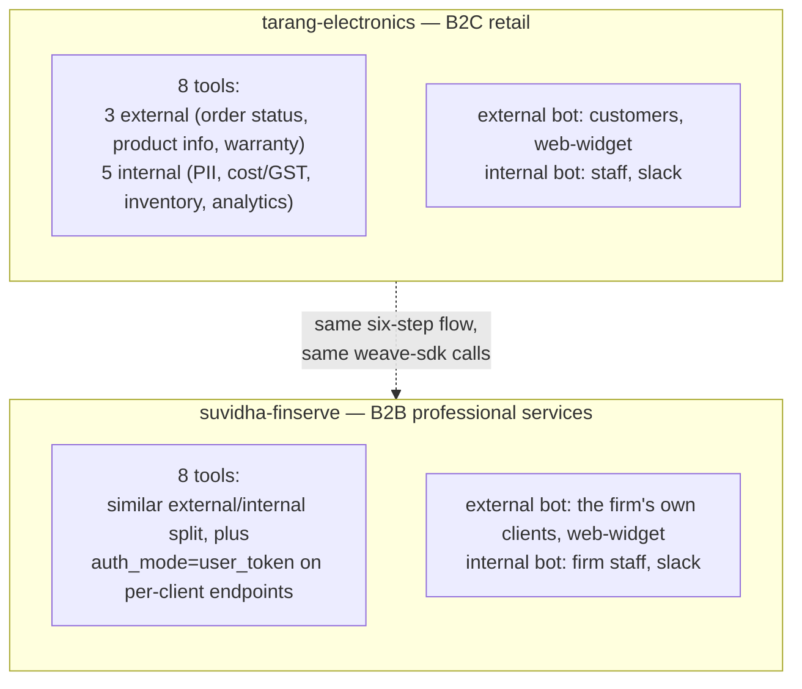
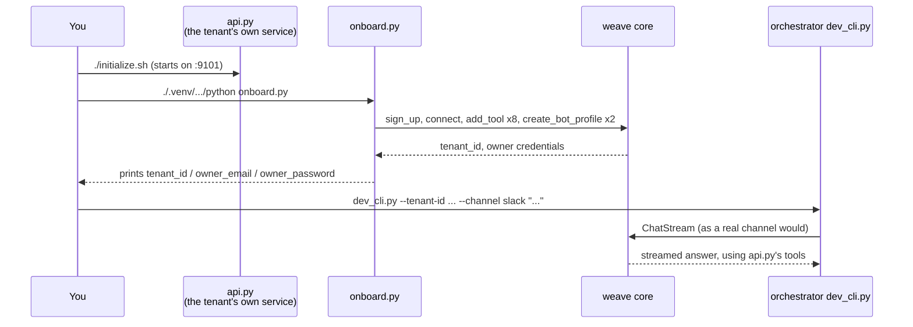

# Demo / reference tenants

Weave ships no fixtures or seed data for "what a tenant integration looks
like" inside this repo — a tenant's integration is their own code in their
own codebase, and demo tenants are no exception (see
[`../architecture/ARCHITECTURE.md`](../architecture/ARCHITECTURE.md) §1's
`connectors` row). Instead, two fully worked, independent reference
projects live as **sibling directories to this repo**, each its own git
repo with its own history:

| Repo | Business shape | Audience split |
|---|---|---|
| [`../../../tarang-electronics`](../../../tarang-electronics) | Indian consumer-electronics retailer (B2C) | `external` = individual customers, `internal` = staff |
| [`../../../suvidha-finserve`](../../../suvidha-finserve) | Indian accounting/bookkeeping firm (B2B) | `external` = the firm's own business clients, `internal` = the firm's staff |

Both install `weave-sdk` from `packages/weave-sdk` (path/git dependency
pre-release, `pip install weave-sdk` once published) and walk the exact
same six-step onboarding flow documented in
[`ONBOARDING.md`](ONBOARDING.md) — read either repo's own `README.md` for
the full narrated walkthrough, or read this page for what each one is
useful for and how they differ.

## Why two, not one

A single demo risks looking like a special case tailored to Weave's own
design. Two, deliberately different in *shape* but identical in *flow*,
show the same six steps generalize:



Where they genuinely differ:

- **Tarang's customers are individual consumers** buying products; none of
  its 8 tools need per-caller scoping (every customer asking
  `check_order_status` gets the same kind of answer, scoped by the order ID
  they supply, not by who they are) — so every tool stays at the SDK's
  default `auth_mode="none"`.
- **Suvidha's "customers" are other businesses** checking their own GST
  filings and invoices — a shape where `auth_mode="user_token"` is
  genuinely relevant (one client must never see another client's filing
  status), and Suvidha's README calls this out explicitly even though its
  own `onboard.py` doesn't turn it on, to keep the walkthrough focused on
  the onboarding *sequence* rather than that one additional decision.

## Running either one

Both need a sibling `weave/` checkout (this repo) and Weave's own stack
already running (`core` + MongoDB/Redis/Qdrant, plus `mcp-gateway` — see
`../../PLAN.md` and `../../infra/`):

```bash
cd ../tarang-electronics    # or ../suvidha-finserve
./initialize.sh             # venv, deps, proto codegen, starts api.py

# in a second shell, once the API is up:
./.venv/Scripts/python.exe onboard.py
```

`onboard.py` narrates all six onboarding steps as it runs and prints
`tenant_id`/`owner_email`/`owner_password` at the end. Each repo's README
then shows the exact `dev_cli.py` invocation to verify step 6 — a real
`ChatStream` call against the tenant `onboard.py` just created, exercising
dynamic tool discovery and the external-profile visibility filter exactly
as a real channel integration would.



## Using these as a template for your own integration

If you're onboarding a real business or personal setup, don't fork either
repo — read it, then write your own `onboard.py`-equivalent against your
own API, following [`ONBOARDING.md`](ONBOARDING.md)'s six steps. The parts
worth copying directly:

- The `external`/`internal` (or per-audience) bot-profile split.
- Writing a real, decision-driven `visibility`/`category` per tool rather
  than defaulting everything to one value.
- `onboard.py`'s pattern of narrating each step out loud as it runs — makes
  a real onboarding script double as living documentation of what got
  registered and why.

## See also

- [`ONBOARDING.md`](ONBOARDING.md) — the step-by-step configuration guide
  these two repos are worked examples of.
- [`../architecture/ARCHITECTURE.md`](../architecture/ARCHITECTURE.md) §3 —
  the mechanics behind `add_tool()`/`add_tools_from_openapi()`,
  `auth_mode`, and per-tool visibility these repos exercise.
- Each repo's own `README.md` — the authoritative, line-by-line walkthrough
  (this page intentionally doesn't restate the config table already there).
