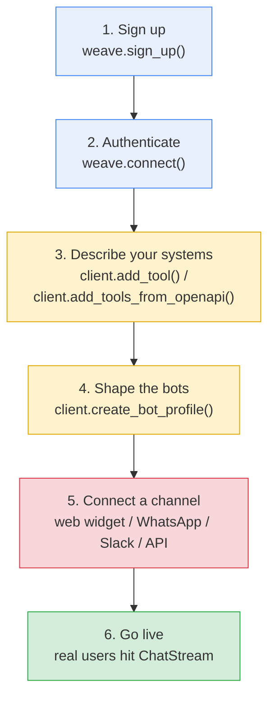
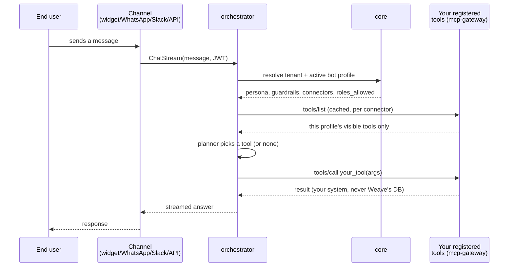
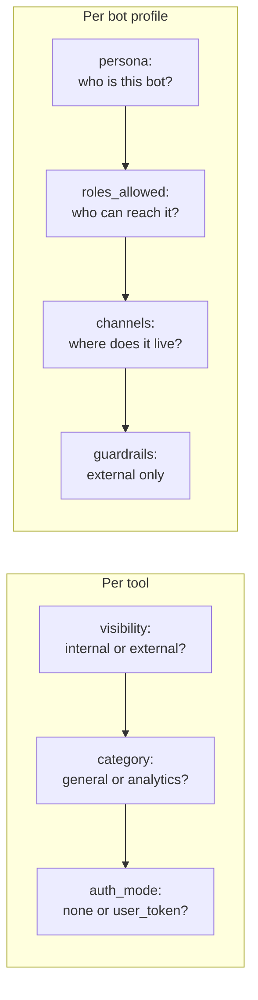

# Onboarding a new tenant — configuration guide

This is the practical, step-by-step guide for wiring a business's (or an
individual's) own systems into Weave. It complements, rather than repeats,
two other docs:

- [`../architecture/ARCHITECTURE.md`](../architecture/ARCHITECTURE.md) explains
  *why* Weave is shaped this way (dynamic tool assembly, per-tool visibility,
  per-bot-profile persona/LLM provider) — read this guide for *what to do*,
  that one for *why it works*.
- [`DEMO_TENANTS.md`](DEMO_TENANTS.md) points at two fully worked reference
  integrations you can read line-by-line or literally run — this guide's
  code samples are the same shape as `onboard.py` in each of those.

If you're the kind of reader who'd rather run something than read about it,
skip straight to [`DEMO_TENANTS.md`](DEMO_TENANTS.md) and come back here for
the parts of the flow it deliberately narrates instead of automating (step 5).

## Who this is for

Anyone bringing a *new tenant* onto Weave — a business connecting its own
CRM/helpdesk/booking/inventory systems, or an individual wiring up personal
accounts (inbox, calendar, notes). "Tenant" means both; Weave doesn't
special-case either shape (see `OVERVIEW.md` §2).

## Before you start

You need:

1. A running Weave stack — `core` + MongoDB/Redis/Qdrant reachable, and
   `mcp-gateway` up if you plan to use the HTTP-tool SDK path below (see
   `infra/` for the local Podman Compose setup).
2. The `weave` SDK installed in your own project — pre-release, a path or
   git dependency on `packages/weave-sdk` (see that package's
   `initialize.sh`); post-release, `pip install weave-sdk`.
3. A list of the HTTP endpoints (or an OpenAPI spec) you want a bot to be
   able to call, each with a clear description already in mind — see
   **Step 3** below for why the description isn't optional.

## The six-step flow

Every tenant — business or individual — goes through the same sequence.
This is the same flow both reference tenants' `onboard.py` scripts run; see
[`DEMO_TENANTS.md`](DEMO_TENANTS.md) to watch it execute end-to-end against
a real running stack.



Steps 3 and 4 (yellow) are where nearly all of your integration-specific
decisions live. Step 5 (red) is the one Weave deliberately does **not**
automate for you — it's specific to how *you* reach your users. Step 6
(green) is just "it works now."

### Step 1 — Sign up

```python
import weave

tenant_id = await weave.sign_up(
    display_name="Acme Clinic",
    email="owner@acme-clinic.example",
    password="a-real-password",
    tenant_type="business",   # or "individual"
)
```

This calls `core`'s public, unauthenticated `CreateTenant` + `Register`
RPCs — there's no token to present before a tenant/user exists at all.
Save the returned `tenant_id`; you'll need it for every step after this.

### Step 2 — Authenticate

```python
client = weave.connect(tenant_id=tenant_id, email="owner@acme-clinic.example", password="a-real-password")
```

`weave.connect()` (sync) logs in and returns a client good for every other
step. Use `weave.connect_async()` directly if your own code is already
async.

### Step 3 — Describe your systems

Register one tool per HTTP endpoint you want a bot to reason over — **not**
one per endpoint you happen to have. An unregistered endpoint is simply
invisible to Weave, never partially exposed.

```python
client.add_tool(
    name="check_order_status",
    description=(
        "Look up the current shipment status of a customer's order by "
        "order ID. Returns the order's status, carrier, and expected "
        "delivery date."
    ),
    endpoint="https://api.acme-clinic.example/orders/{order_id}/status",
    method="GET",
    visibility="external",   # also usable by customer-facing bot profiles
    category="general",
)
```

Two decisions you must make **per tool**, deliberately, with no safe
default:

| Field | Values | What it controls |
|---|---|---|
| `visibility` | `"internal"` (default) \| `"external"` | Whether a customer-facing bot profile can ever see this tool. Staff-only data (cost, GST, another customer's PII) stays `"internal"`. |
| `category` | `"general"` (default) \| `"analytics"` | Routes the tool to the analytics specialist agent instead of the general tools agent. |

A third, optional field — `auth_mode="user_token"` — scopes a tool to the
*specific signed-in user* asking (e.g. "my own invoices"), not just any
authorized caller. See `ARCHITECTURE.md` §3 for the full HMAC-signing
mechanism; most tools don't need it.

**Have more than a handful of endpoints?** Don't hand-write dozens of
`add_tool()` calls — hand Weave your existing OpenAPI spec instead:

```python
client.add_tools_from_openapi(
    my_openapi_spec,
    include={"getOrderStatus", "getProductInfo", "getWarrantyStatus"},
    default_visibility="internal",
    default_category="general",
)
```

`include`/`exclude` (mutually exclusive) select which operations become
tools; per-operation `x-weave-visibility`/`x-weave-category`/
`x-weave-auth-mode` extension keys override the defaults for any operation
that needs to differ.

**Every tool needs a real description.** Not a label — documentation. The
planner decides *whether and how* to call a tool from its description
alone, and the description travels with the tool's result too. `core`
rejects a connector manifest with any undescribed tool at registration
time, on purpose (see `ARCHITECTURE.md` §3, "Tool descriptions are
mandatory").

### Step 4 — Shape the bots

Create one bot profile per distinct audience. Most tenants create at least
two:

```python
external = client.create_bot_profile(
    name="external",
    persona=(
        "You are Acme Clinic's booking assistant. Be warm and concise; "
        "never discuss another patient's appointments."
    ),
    channels=["web-widget", "whatsapp"],
    roles_allowed=["customer"],
    guardrails=[
        "Never disclose a patient's diagnosis or medication.",
        "Never disclose another patient's contact details.",
    ],
)

internal = client.create_bot_profile(
    name="internal",
    persona="You are Acme Clinic's staff assistant. You may see full patient records.",
    channels=["slack"],
    roles_allowed=["staff", "admin"],
)
```

| Field | Meaning |
|---|---|
| `persona` | The bot's entire system prompt, verbatim — not a file path. Write who this bot is, its tone, its scope. Left `""`, it gets a generic fallback. |
| `channels` | Which channel(s) this profile is reachable on — `"web-widget"`, `"whatsapp"`, `"slack"`, or a raw API caller. |
| `roles_allowed` | Which roles (`"owner"`\|`"admin"`\|`"staff"`\|`"customer"`) can reach this profile. |
| `guardrails` | Free-text disclosure rules, enforced only when `visibility="external"`. |
| `llm_provider`/`llm_model` | Which already-configured LLM backend answers this profile's turns — `""`/`"ollama"` (local default) or `"openai"` (anything speaking the OpenAI chat-completions wire format). Not a place to hand Weave your own API key. |
| `connector_ids` | Defaults to your tenant's single `weave_managed` connector (every `add_tool()`'d tool lives there) — override only if you're also running a hand-rolled MCP server. |

A business's `external` and `internal` profiles typically differ in every
one of these fields; an individual tenant typically just needs one.

### Step 5 — Connect a channel

This is the step Weave intentionally leaves to you, because it's specific
to how *you* reach your users:

- **Web widget** — embed `web`'s chat widget on your own site, pointed at
  a profile's `web-widget` channel.
- **WhatsApp** — wire the WhatsApp Business API webhook to Weave's channel
  adapter, pointed at a profile with `"whatsapp"` in its `channels` list.
- **Slack** — install a Slack app pointed at a profile's `slack` channel.
- **Raw API** — call the `ChatStream` gRPC/grpc-web endpoint directly; no
  channel adapter needed at all.

Nothing listens on a channel until you do this — there's no default
channel a fresh bot profile is automatically reachable on.

### Step 6 — Go live

Once a channel exists, real end users interact through it. Before that,
verify the exact same `ChatStream` RPC a real channel would call using
`orchestrator`'s own dev harness (`orchestrator/dev_cli.py`) — see either
reference tenant's README for a copy-pasteable example.

## Request flow, once you're live

This is what happens on every message once onboarding is done — useful for
debugging "why didn't my bot see this tool" or "why did it answer this way."



Full detail — including the multi-agent supervisor and per-tool auth — is
in [`../architecture/ARCHITECTURE.md`](../architecture/ARCHITECTURE.md) §2–3.

## Common configuration decisions, at a glance



## Troubleshooting checklist

| Symptom | Likely cause |
|---|---|
| Bot can't see a tool you registered | `visibility="internal"` on a tool you're calling from an `external` profile, or the tool has no `description` (registration would have been rejected) |
| Bot answers with a generic persona | `persona=""` on that bot profile |
| A customer sees another customer's data | Missing or incomplete `guardrails` on the `external` profile — see `docs/architecture/SECURITY.md` §6 |
| "Which connector is this tool on?" | Every registered `add_tool()` call lands on your tenant's single `weave_managed` connector unless you're also running a hand-rolled MCP server |
| Nothing responds when you message your channel | Step 5 was skipped — no channel is wired to a profile by default |

## Next steps

- Read [`DEMO_TENANTS.md`](DEMO_TENANTS.md) and run one of the two
  reference integrations end-to-end.
- Read `docs/architecture/SECURITY.md` before onboarding any tenant whose
  data matters — several hardening gaps (credential rotation,
  service-to-service auth) are tracked there and are still open.
