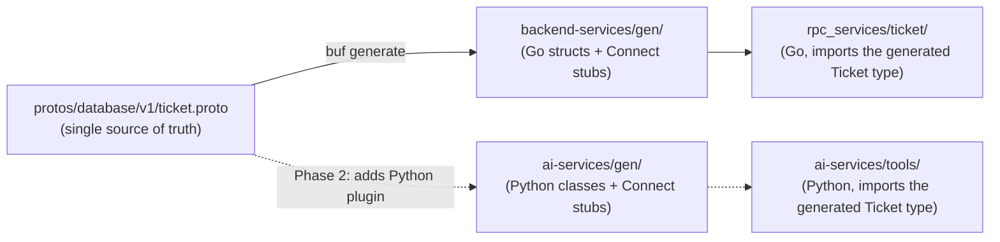

# Protocol Buffers & `buf` Codegen

> Module 0 · Phase 0 · Generated from: `protos/database/v1/ticket.proto`, `protos/backend_services/data_access/v1/ticket.proto`, `protos/buf.yaml`, `protos/buf.gen.yaml`

## 1. Theory

Every service in this project needs to agree, precisely, on the shape of the data it sends and receives — a Go server, a Python client, and (eventually) a browser all need the *same* understanding of what a `Ticket` looks like and what `CreateTicket` accepts and returns. If each language re-declares that shape by hand (a Go struct here, a Pydantic model there, a TypeScript interface somewhere else), the three inevitably drift: someone renames a field in Go and forgets Python, and the bug doesn't show up until a live request fails at runtime.

Protocol Buffers (protobuf) solve this by putting the contract in exactly one place, in a language-neutral `.proto` file, and generating each language's version of it from that single source. The `.proto` file is not documentation of the contract — it *is* the contract. A code generator (`protoc`, or `buf` as a modern wrapper around it with plugins) reads the `.proto` and emits real, type-checked Go structs, Python classes, TypeScript types, etc. If the contract changes, you regenerate, and the compiler in every language immediately tells you everywhere the change broke something — instead of a silent runtime mismatch.

`buf` is the tool this project uses instead of raw `protoc`. It adds three things protoc alone doesn't give you well: a lint step that enforces a consistent style across every `.proto` in the repo, a "breaking change" detector that can fail CI if a change would break existing clients, and a simpler, declarative way to configure which plugins generate what, into which output directories.

## 2. Key Concepts & Terminology

- **`.proto` file** — a schema file written in the Protocol Buffers language: `message` blocks define data shapes, `service`/`rpc` blocks define remote calls. This project's proto files live under `protos/`, one directory tree per concern (see §3).
- **`message`** — a typed record, protobuf's equivalent of a struct/class. Fields are numbered (`string subject = 4;`) — that number, not the name, is what's actually sent on the wire, which is how protobuf allows safe field renames later.
- **`service` / `rpc`** — declares a callable remote method and its request/response message types (e.g. `rpc CreateTicket(CreateTicketRequest) returns (CreateTicketResponse);`). A `service` block is what `buf`'s Connect plugin turns into real client and server code (see the gRPC & Connect topic doc).
- **`package`** — protobuf's namespace, always versioned in this repo (`database.v1`, `backend_services.data_access.v1`) so a breaking change can go out under a new version instead of silently breaking `v1` callers.
- **`buf.yaml`** — per-module config: which lint/breaking-change rules apply. This repo uses the `STANDARD` lint ruleset.
- **`buf.gen.yaml`** — codegen config: which plugins run, and where their output lands. Ours currently runs two Go plugins; Python plugins get added in Phase 2 once `ai-services` exists.
- **`buf lint` / `buf generate` / `buf breaking`** — the three commands you actually run: validate style, regenerate stubs, and (in CI, from Phase 13 onward) check for wire-incompatible changes against a previous commit.
- **Codegen plugin** — a small program (`protoc-gen-go`, `protoc-gen-connect-go`) that `buf`/`protoc` invoke per file to emit one language's stubs. `protoc-gen-go` emits plain Go structs; `protoc-gen-connect-go` emits the Connect client/handler code layered on top of those structs.

## 3. How this project uses it

`protos/` is organized by concern, not by language — see `CLAUDE.md`'s repo layout. Two directories matter for Module 0:

- **`protos/database/v1/`** holds every schema that is actually *stored* — one `.proto` per entity. A message that backs a MongoDB collection carries an exact, greppable comment convention:
  ```protobuf
  // is_collection: true
  // Mongo collection "tickets", owned by backend-services/mongodb/ticket.go.
  message Ticket {
    string _id = 1;
    ...
  }
  ```
  This is *not* a protobuf language feature — it's a plain comment convention this project adopted so a human (or a future script) can find every stored entity with `rg "is_collection: true" protos/database`. See the MongoDB data-tier topic doc for why the `_id` field specifically matters.

- **`protos/backend_services/data_access/v1/`** holds RPC contracts *only* — `Request`/`Response` messages and the `service` block. It never redeclares an entity's fields; it `import`s the entity from `database/v1` and references it:
  ```protobuf
  import "database/v1/ticket.proto";

  message CreateTicketResponse {
    database.v1.Ticket ticket = 1;
  }
  ```
  This split (entity schema vs. RPC contract) means the stored shape and the wire contract for a given RPC can't drift independently — there's exactly one `Ticket` definition, referenced everywhere.

`protos/buf.yaml` configures `STANDARD` lint (which itself enforces things like "every field is `lower_snake_case`", "package names carry a version suffix", "RPC request/response type names match the RPC method name"). `protos/buf.gen.yaml` currently wires two plugins, both Go, both writing into `backend-services/gen/`:

```yaml
plugins:
  - local: protoc-gen-go
    out: ../backend-services/gen
    opt: paths=source_relative
  - local: protoc-gen-connect-go
    out: ../backend-services/gen
    opt: paths=source_relative
```

## 4. Worked example

Trace one real field from its single definition through to generated Go code.

The source of truth, `protos/database/v1/ticket.proto`:
```protobuf
message Ticket {
  // buf:lint:ignore FIELD_LOWER_SNAKE_CASE
  string _id = 1;
  string tenant_id = 2;
  ...
}
```

Running `buf generate` from `protos/` emits `backend-services/gen/database/v1/ticket.pb.go`, containing (among other things):
```go
type Ticket struct {
	XId      string `protobuf:"bytes,1,opt,name=_id,json=_id,proto3" json:"_id,omitempty"`
	TenantId string `protobuf:"bytes,2,opt,name=tenant_id,json=tenantId,proto3" json:"tenant_id,omitempty"`
	...
}

func (x *Ticket) GetXId() string { ... }
func (x *Ticket) GetTenantId() string { ... }
```

Every downstream Go file — `backend-services/mongodb/ticket.go`, `backend-services/rpc_services/ticket/routehandler.go` — imports this generated `databasev1.Ticket` type and uses it directly; nothing hand-writes an equivalent struct. When Phase 2 adds Python codegen to `buf.gen.yaml`, the exact same `.proto` will also produce a Python class with the same fields, generated from the same source.

## 5. Diagram



## 6. Exercise

1. Add a `string assignee_id = 11;` field to `Ticket` in `protos/database/v1/ticket.proto`. Run `buf lint` — it should pass (field is already `lower_snake_case`). Run `buf generate` and open the regenerated `ticket.pb.go` — find the new `AssigneeId` field and its `GetAssigneeId()` getter.
2. Try adding a field named `AssigneeID` (PascalCase) instead, and run `buf lint` again — read the exact rule name it fails on (it's the same `FIELD_LOWER_SNAKE_CASE` rule that `_id` needs an explicit `// buf:lint:ignore` for).
3. Delete the generated `backend-services/gen/` directory entirely and run `buf generate` again from `protos/` — confirm the whole tree regenerates byte-for-byte identical (proving `gen/` is disposable, derived output, not something to hand-edit or worry about losing).

## 7. Common mistakes

- **Hand-editing files under `gen/`.** They're regenerated wholesale on every `buf generate` — any manual fix silently vanishes the next time someone runs codegen. If generated code is wrong, the bug is in the `.proto` or the plugin config, not the output.
- **Redeclaring an entity's fields in an RPC contract proto** instead of importing it from `database/v1`. This is exactly the drift protobuf is supposed to prevent — see §3's `CreateTicketResponse` example for the correct pattern.
- **Forgetting `buf lint` before `buf generate`.** Lint catches naming/style problems (and, from Phase 13's CI wiring onward, breaking changes) *before* you've generated code and written application logic against it — cheaper to fix a `.proto` than to fix a `.proto` plus every file that imported the wrong generated shape.
- **Treating field *numbers* as unimportant.** The number (`= 1`, `= 2`, ...) — not the field name — is what's actually serialized on the wire. Renaming a field is safe; reusing a number for a different field, or renumbering existing fields, breaks wire compatibility with anything that has old data or an old client.

## 8. Further reading

- [Protocol Buffers language guide (proto3)](https://protobuf.dev/programming-guides/proto3/)
- [buf CLI documentation](https://buf.build/docs/introduction)
- [buf lint rules reference](https://buf.build/docs/lint/rules)

## 9. Related topics

- [gRPC & Connect](02-grpc-connect.md) — what the generated `service`/`rpc` code actually becomes at runtime.
- [Go data-access services](03-go-data-access.md) — how `backend-services` consumes the generated Go stubs.
- [MongoDB modeling & the single-DB-tier boundary](04-mongodb-data-tier.md) — the `is_collection`/`_id` conventions this doc referenced.
