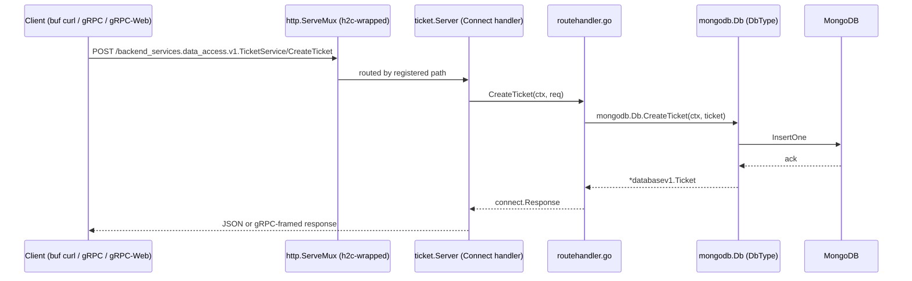

# gRPC & Connect (Transport, Streaming, gRPC-Web)

> Module 0 · Phase 0 · Generated from: `backend-services/main.go`, `backend-services/gen/backend_services/data_access/v1/dataaccessv1connect/ticket.connect.go`, `backend-services/gen/database/v1/databasev1connect/health.connect.go`

## 1. Theory

Once a contract is defined in protobuf (see the previous topic doc), something has to actually carry a call over the network according to that contract: serialize the request, send it, deserialize the response, and do it in a way both sides agree on. That's gRPC's job — a binary RPC protocol built on HTTP/2, generated directly from a proto `service` definition, so a client's method call (`CreateTicket(req)`) becomes a real network request without anyone hand-writing HTTP routing or JSON parsing.

Plain gRPC has a real gap for this project though: browsers can't speak raw gRPC (no HTTP/2 trailer support in `fetch`), so a normal gRPC service is invisible to a Next.js app or a curl command without an extra translation layer (an Envoy proxy, typically). This project deliberately avoided that extra hop. **Connect** (from the makers of buf) is a protocol and set of libraries that make one server simultaneously speak gRPC, gRPC-Web (the browser-safe variant), and plain HTTP/JSON — from the exact same generated handler, no proxy process required. That's why every server in this system (`backend-services` today; `ai-services`/`analysis-services` from Phase 2 onward) is a Connect server, not a bare `google.golang.org/grpc` server.

## 2. Key Concepts & Terminology

- **Unary RPC** — one request, one response (`CreateTicket`, `GetTicket`). Everything in `backend-services` so far is unary.
- **Server-streaming RPC** — one request, a stream of responses over time. Not used yet in this repo, but this is exactly what `ai-services`' `ChatStream` RPC (Phase 2) will be, for token-by-token LLM output.
- **h2c** — "HTTP/2 cleartext": HTTP/2 without TLS. Local dev needs this because gRPC requires HTTP/2, but setting up real certificates for `localhost` is unnecessary friction — `golang.org/x/net/http2/h2c` lets the Go standard `net/http` server speak plaintext HTTP/2.
- **Connect handler** — server-side generated code (`NewTicketServiceHandler`) that takes your business logic (anything implementing the `TicketServiceHandler` interface) and returns a standard Go `http.Handler`, mountable on a normal `http.ServeMux` right alongside any other handler.
- **Connect client** — client-side generated code (`NewTicketServiceClient`) that gives you a typed Go (or Python, once Phase 2 adds codegen) function call for each RPC, hiding the actual HTTP request.
- **Interceptor** — middleware for Connect calls (auth, logging, tracing) that wraps every request/response. `connect.WithInterceptors()` is where `packages/shared-auth`'s JWT-verify interceptor will plug in from Phase 1 onward.
- **`grpcurl`/`buf curl`** — command-line tools for calling a gRPC/Connect service without writing a client. This repo uses `buf curl`, since it can read the schema straight from `protos/` instead of needing a separately-registered reflection service.

## 3. How this project uses it

`backend-services/main.go` wires exactly one `http.ServeMux`, with one handler registered per RPC service:

```go
mux := http.NewServeMux()
mux.Handle(dataaccessv1connect.NewTicketServiceHandler(&ticket.Server{}, connect.WithInterceptors()))
mux.Handle(databasev1connect.NewHealthServiceHandler(health.NewHandler()))

srv := &http.Server{
	Addr:    configs.Vars.ServerAddr,
	Handler: h2c.NewHandler(mux, &http2.Server{}),
}
```

Two things worth noticing:
- **Every service gets the shared `HealthService`** (`protos/database/v1/health.proto`), not a bespoke one — so any Connect server in this system, in any language, answers `Check` the same way. `backend-services/health/handler.go` implements it by reading `mongodb.Healthy`, a flag kept current by a background ping loop (`mongodb.StartHealthMonitor`).
- **`h2c.NewHandler` wraps the whole mux, once** — this is the one line that makes plain gRPC calls work locally without TLS. Forgetting it (or swapping in a bare `http.ListenAndServe` without the h2c wrapper) is a common way to silently break gRPC clients while HTTP/JSON calls keep working, since Connect's HTTP/JSON codec doesn't need HTTP/2 at all.

Because the server is Connect (not raw `google.golang.org/grpc`), the exact same `CreateTicket` endpoint is reachable three ways without any extra code: a gRPC client, a gRPC-Web client (a future Next.js app), or a plain HTTP POST with a JSON body — which is what makes `buf curl` (and even a raw browser `fetch`) work against it today.

## 4. Worked example

Calling the running server with `buf curl`, from `protos/` (so it can resolve the schema):

```bash
buf curl --schema . -d "@create_ticket.json" \
  http://localhost:8081/backend_services.data_access.v1.TicketService/CreateTicket
```

where `create_ticket.json` is:
```json
{"tenant_id":"it-services","customer_id":"cus_001","subject":"Login broken","priority":"TICKET_PRIORITY_HIGH"}
```

This is a real HTTP POST to `/backend_services.data_access.v1.TicketService/CreateTicket` — the URL path is derived directly from the proto `package.Service/Method`. Connect's server decodes it (as HTTP/JSON in this case, since that's what `buf curl` sent), routes it to `ticket.Server.CreateTicket` (the handler registered in `main.go`), which delegates to `mongodb.Db.CreateTicket`, and returns:

```json
{"ticket": {"Id": "tkt_01KY7MN582S7C4FMVFSGGGQDWC", "tenantId": "it-services", ..., "status": "TICKET_STATUS_OPEN"}}
```

The exact same endpoint would also accept a real gRPC client's binary-framed request on the same port — no separate code path.

## 5. Diagram



## 6. Exercise

1. Call `Health.Check` (not `CreateTicket`) with `buf curl` against the running server (`http://localhost:8081/database.v1.HealthService/Check`) with an empty JSON body (`{}`), and confirm you get `STATUS_SERVING` back.
2. Temporarily comment out `h2c.NewHandler(mux, &http2.Server{})` in `main.go` (replace with just `mux`), rebuild, and try the same `buf curl` call in gRPC mode (`buf curl --protocol grpc ...`) vs. its default HTTP/JSON mode — observe which one breaks and which keeps working, to see exactly what h2c buys you.
3. Read `dataaccessv1connect/ticket.connect.go`'s generated `NewTicketServiceClient` function — note it takes an `httpClient` and a `baseURL`, and can be constructed with `connect.WithGRPC()` or `connect.WithGRPCWeb()` options to force a specific wire protocol instead of Connect's default.

## 7. Common mistakes

- **Standing up a bare `google.golang.org/grpc.Server` instead of a Connect handler.** That works for gRPC clients but is invisible to `curl`/browsers without an Envoy-style proxy — exactly the extra infrastructure this project's architecture (`OVERVIEW.md` §3) chose to avoid.
- **Forgetting the h2c wrapper**, then being confused when gRPC clients fail but HTTP/JSON calls (like `buf curl`'s default mode) keep working fine — the two codecs have different transport requirements.
- **Registering interceptors per-handler inconsistently.** `connect.WithInterceptors()` is currently empty (no auth yet, per Phase 0/1's "no auth interceptor" note in `backend-services/CLAUDE.md`) — when Phase 10 wires `packages/shared-auth` in, it needs to go on *every* handler's registration, not just some.
- **Confusing the Connect protocol with gRPC-Web.** Connect is a superset: it's Connect's own protocol *plus* it can also speak gRPC and gRPC-Web from the same code. A client explicitly asking for gRPC-Web still hits the same handler.

## 8. Further reading

- [Connect protocol documentation](https://connectrpc.com/docs/introduction)
- [gRPC concepts](https://grpc.io/docs/what-is-grpc/core-concepts/)
- [buf curl documentation](https://buf.build/docs/curl/usage)

## 9. Related topics

- [Protocol Buffers & buf codegen](01-protobuf-buf.md) — where the `service`/`rpc` definitions this doc runs actually come from.
- [Go data-access services](03-go-data-access.md) — what's on the other side of the handler (`ticket.Server` → `mongodb.Db`).
