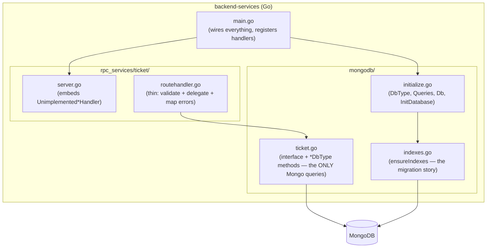

# Go Data-Access Services (`connect-go`)

> Module 0 · Phase 0 · Generated from: `backend-services/main.go`, `backend-services/mongodb/initialize.go`, `backend-services/mongodb/ticket.go`, `backend-services/rpc_services/ticket/{server,routehandler}.go`, `backend-services/CLAUDE.md`

## 1. Theory

`CLAUDE.md`'s single hardest rule is that `backend-services` is the *only* tier allowed to hold MongoDB credentials — every other service, in any language, reaches data by calling one of its RPCs. That rule only stays true in practice if adding a new piece of stored data has one obvious, repeatable shape to follow; otherwise different collections end up wired inconsistently and the boundary erodes over time.

This project's answer is an **RPC-per-collection** layout: every MongoDB collection gets exactly one Connect service, and that service is built from the same three pieces every time — a Mongo-touching implementation (`mongodb/<collection>.go`), a thin Connect handler that delegates to it (`rpc_services/<collection>/`), and an index bootstrap entry. The pattern is deliberately boring and repetitive — see `backend-services/CLAUDE.md`'s 8-step "Adding a new collection RPC" recipe — because boring and repeatable is what keeps thirteen collections (the eventual full domain set, per `PLAN.md`) from turning into thirteen different ad hoc designs.

## 2. Key Concepts & Terminology

- **`DbType`** — the one struct holding every Mongo collection handle (`*mongo.Collection`) this server uses. One field per collection.
- **`Queries` interface** — an interface that embeds one smaller interface per collection (just `Ticket` today). Nothing in the codebase depends on the concrete `*DbType`; handlers depend only on `Queries`, so a test could substitute a fake implementation without touching Mongo at all.
- **Package-level `Db Queries`** — assigned once, in `InitDatabase`, at startup. Every RPC handler calls `mongodb.Db.<Method>(...)` — a single shared handle, not one connection per request.
- **`mongodb/<collection>.go`** — defines the collection's interface (e.g. `Ticket`) *and* implements it as methods on `*DbType`. This is the *only* file, per collection, that contains an actual MongoDB query.
- **`rpc_services/<collection>/server.go` + `routehandler.go`** — the Connect-facing half. `server.go` is a one-line struct embedding the generated `Unimplemented*Handler` (so adding a new RPC to the proto doesn't break compilation of existing handlers — it just panics at runtime for the unimplemented one until you add it). `routehandler.go` implements each RPC method, and — this is the rule worth internalizing — **contains no business logic**, only: validate the request shape, call the matching `mongodb.Db` method, map errors to Connect status codes, wrap the result.
- **Index bootstrap (not "migrations")** — MongoDB is schemaless, so there's no `ALTER TABLE` step. `mongodb/indexes.go`'s `ensureIndexes` runs on every startup and is idempotent (`CreateMany` on indexes that already exist is a no-op) — this *is* this project's migration story for a document database.

## 3. How this project uses it

Tracing one collection (`ticket`) through all three pieces:

**`mongodb/ticket.go`** — the only file that touches Mongo for tickets:
```go
type Ticket interface {
	CreateTicket(ctx context.Context, t *databasev1.Ticket) (*databasev1.Ticket, error)
	GetTicket(ctx context.Context, tenantID, id string) (*databasev1.Ticket, error)
	ListTickets(ctx context.Context, tenantID, customerID string, pageSize int32, pageToken string) ([]*databasev1.Ticket, string, error)
}

func (db *DbType) CreateTicket(ctx context.Context, t *databasev1.Ticket) (*databasev1.Ticket, error) {
	// idempotency dedup, defaulting, SLA calculation — all business logic lives here
	...
	if _, err := db.TicketCollection.InsertOne(ctx, t); err != nil {
		return nil, fmt.Errorf("insert ticket: %w", err)
	}
	return t, nil
}
```

**`rpc_services/ticket/routehandler.go`** — deliberately thin, no logic beyond validation and delegation:
```go
func (s *Server) CreateTicket(ctx context.Context, req *connect.Request[dataaccessv1.CreateTicketRequest]) (*connect.Response[dataaccessv1.CreateTicketResponse], error) {
	msg := req.Msg
	if msg.TenantId == "" || msg.Subject == "" {
		return nil, connect.NewError(connect.CodeInvalidArgument, errors.New("tenant_id and subject are required"))
	}
	t, err := mongodb.Db.CreateTicket(ctx, &databasev1.Ticket{ /* map request fields */ })
	if err != nil {
		return nil, connect.NewError(connect.CodeInternal, err)
	}
	return connect.NewResponse(&dataaccessv1.CreateTicketResponse{Ticket: t}), nil
}
```

Notice what's *not* here: no SLA math, no idempotency check, no defaulting logic. All of that lives in `mongodb/ticket.go`. If you find yourself writing an `if` statement about business rules inside a `routehandler.go`, that's the signal it belongs one layer down instead.

**`main.go`** wires it all together at startup, in this exact order: config → Mongo connection → index bootstrap → register every RPC service on the mux → serve:
```go
configs.InitializeConfig()
mongodb.InitDatabase(ctx)          // connects, wires DbType, runs ensureIndexes
go mongodb.StartHealthMonitor(ctx) // background ping loop

mux := http.NewServeMux()
mux.Handle(dataaccessv1connect.NewTicketServiceHandler(&ticket.Server{}, connect.WithInterceptors()))
```

## 4. Worked example

Adding a *second* collection (a hypothetical, not yet built — this is what Phase 1's `chat`/`knowledge-base`/`calendar`/`auth` will each actually do) follows exactly this shape:

1. Add the entity to `protos/database/v1/<name>.proto` (`is_collection: true`, `_id` first field), and the RPC contract to `protos/backend_services/data_access/v1/<name>.proto`. `buf generate`.
2. `mongodb/<name>.go` — define the interface, implement it on `*DbType`, using a real `*mongo.Collection` field.
3. Add that new field to `DbType` in `initialize.go`, wire it in `InitDatabase`, and embed the new interface into `Queries`.
4. `mongodb/indexes.go` — add the new collection's index block.
5. `rpc_services/<name>/server.go` + `routehandler.go`.
6. Register the new handler in `main.go`'s mux.

Every one of these steps mirrors what `ticket` already does — there's no new pattern to invent, just the same shape applied again.

## 5. Diagram



## 6. Exercise

1. In `mongodb/ticket.go`, add a new method `CountTickets(ctx, tenantID string) (int64, error)` using `db.TicketCollection.CountDocuments`. Add it to the `Ticket` interface. Don't wire an RPC for it yet — just prove the pattern compiles (`go build ./...`).
2. Now expose it: add a `CountTicketsRequest`/`Response` + RPC to the ticket proto, regenerate, add the method to `rpc_services/ticket/routehandler.go` (one line: validate tenant, call `mongodb.Db.CountTickets`, wrap the response), register nothing new in `main.go` (it's the same `TicketService` handler). Call it with `buf curl`.
3. Read `backend-services/CLAUDE.md`'s full 8-step recipe and compare it against what you just did — identify which step you'd have missed if you were building a genuinely new collection (hint: the index bootstrap and `DbType` wiring, since `ticket` already existed for this exercise).

## 7. Common mistakes

- **Putting validation or business logic in `routehandler.go`.** It should read as "check the request looks sane, hand off to `mongodb.Db`, translate the error" — nothing more. If a rule like "default priority to MEDIUM if unset" ends up in a routehandler instead of the `mongodb` layer, a second caller of the same `mongodb.Db` method (a future direct Go caller, a test) won't get that rule applied consistently.
- **Depending on `*mongodb.DbType` directly instead of the `Queries` interface.** Handlers should only ever reference `mongodb.Db` (typed as `Queries`) — never construct or type-assert a concrete `*DbType` — so the dependency stays swappable/testable.
- **Forgetting to add a new collection's field to `DbType` and wire it in `InitDatabase`.** The interface method won't compile without a receiver, which usually catches this — but it's easy to add the interface method and the `mongodb/<name>.go` implementation and forget the `initialize.go` wiring, especially copy-pasting from an existing collection.
- **Skipping the index bootstrap.** MongoDB will happily let you query an unindexed collection — slowly, and without the uniqueness guarantees a `tenant_id`+`idempotency_key` sparse-unique index is there to enforce. This bites in production, not in a quick local test with a handful of documents.

## 8. Further reading

- [Effective Go](https://go.dev/doc/effective_go) — general Go idioms this codebase follows (small interfaces, explicit error wrapping).
- [MongoDB Go Driver v2 documentation](https://www.mongodb.com/docs/drivers/go/current/)
- [Connect-Go documentation](https://connectrpc.com/docs/go/getting-started)

## 9. Related topics

- [gRPC & Connect](02-grpc-connect.md) — the transport `rpc_services/` handlers run on.
- [MongoDB modeling & the single-DB-tier boundary](04-mongodb-data-tier.md) — the `_id`/`is_collection` conventions `mongodb/<collection>.go` files depend on.
