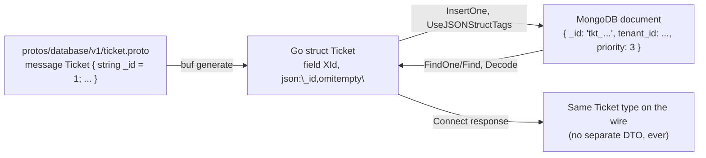

# MongoDB Modeling & the Single-DB-Tier Boundary

> Module 0 · Phase 0 · Generated from: `backend-services/mongodb/{initialize,ticket,indexes}.go`, `protos/database/v1/ticket.proto`, `backend-services/CLAUDE.md`, `docs/architecture/OVERVIEW.md` §12

## 1. Theory

This project has two related but distinct rules about data, and it's worth separating them clearly:

1. **What database**: MongoDB — a document database, chosen because a multi-tenant AI-assistant backbone's schema genuinely evolves per firm (a domain pack might need fields no other tenant has) and per phase (this project itself adds a new collection roughly every phase through Phase 10). A document model tolerates that kind of organic, additive schema change far better than a rigid relational schema with `ALTER TABLE` migrations for every new field.
2. **Who's allowed to touch it**: only `backend-services`. This is the more important rule architecturally. Every other service — `ai-services`, `analysis-services`, any MCP server, any channel adapter — reaches data exclusively through a `backend-services` RPC, never a direct Mongo connection. This is the same shape as the LLM tool-calling trust boundary (`CLAUDE.md`): one narrow, typed, auditable gate instead of many services independently deciding how to query a shared database.

Given rule 2, rule 1's schema flexibility needs *some* discipline, or "every collection is its own bespoke thing" becomes as much of a maintenance problem as a rigid schema would have been. This project's discipline is the `is_collection: true` convention (previous topic docs) plus a specific storage trick — described below — that keeps the stored document and the wire contract as literally the same type, not two hand-synced ones.

## 2. Key Concepts & Terminology

- **Collection / document** — Mongo's rough equivalents of a table and a row, except a document can have nested structure and doesn't require every document in a collection to share an identical shape.
- **`_id`** — every MongoDB document has one, and it's the collection's real, enforced-unique primary key (Mongo builds an index on it automatically, for free, on every collection). This project deliberately makes its own entity ID *be* that field, rather than inventing a separate app-level ID and letting Mongo's `_id` sit unused as an auto-generated ObjectId — see §3.
- **BSON** — the binary format Mongo actually stores documents in (a superset of JSON with more types, like native dates). The Go driver needs to know how to map a Go struct's fields to BSON field names — normally via `bson:"..."` struct tags.
- **`UseJSONStructTags`** — a MongoDB Go driver option that says "map BSON fields using the struct's existing `json:"..."` tags instead of requiring separate `bson:"..."` ones." This project uses it specifically because `protoc-gen-go` already emits `json:` tags on every generated message — so the *exact same* generated `Ticket` struct that flows through Connect as the wire type can also be handed straight to `InsertOne`/`FindOne` as the stored document, with zero extra mapping code.
- **Index bootstrap** — this project's replacement for schema migrations. `mongodb/indexes.go`'s `ensureIndexes`, called once at startup, idempotently creates every index the service depends on. There's no separate "migration" concept because there's no schema to migrate — only indexes to guarantee exist.
- **Tenant scoping** — every document that's firm-specific carries a `tenant_id` field, and (from Phase 11 onward) every query is required to filter by it. Even before full multi-tenancy lands, this project's convention is to write that field and that index from day one rather than bolt it on later.

## 3. How this project uses it

The single biggest modeling decision Module 0 made: **store the generated proto message directly as the MongoDB document**, with no separate hand-written "DB model" struct. This is what `UseJSONStructTags` is for, set once in `mongodb/initialize.go`:

```go
bsonOpts := &options.BSONOptions{
	UseJSONStructTags: true,
	NilSliceAsEmpty:   true,
	NilMapAsEmpty:     true,
}
client, err := mongo.Connect(options.Client().ApplyURI(...).SetBSONOptions(bsonOpts))
```

For this to work correctly for the entity's *primary key* specifically, the proto field has to literally be named `_id` (not `id`) — because `UseJSONStructTags` derives the BSON field name from the `json:` tag, and protoc-gen-go's `json:` tag always mirrors the original proto field name verbatim. There's no proto-level option that can alias a differently-named field to serialize as `_id`; the field has to be named that from the start. This is exactly why every `is_collection: true` message's convention (root `CLAUDE.md`) is:

```protobuf
message Ticket {
  // buf:lint:ignore FIELD_LOWER_SNAKE_CASE
  string _id = 1;
  ...
}
```

The cost of this choice: `protoc-gen-go` can't emit `Id` as the Go field name for a field starting with an underscore (it's not a legal exported-identifier-looking name), so it emits `XId` instead (`t.XId`, `t.GetXId()`). That's a deliberate, accepted tradeoff — a slightly unusual Go name in exchange for Mongo's *actual* primary key, its automatic uniqueness guarantee, and its default index, all for free, with zero risk of a hand-maintained "DB model" struct drifting from the wire type.

`mongodb/indexes.go` then adds only the *additional* indexes queries actually need beyond that automatic `_id` index:

```go
db.TicketCollection.Indexes().CreateMany(ctx, []mongo.IndexModel{
	{ // tenant-scoped cursor pagination on ListTickets
		Keys: bson.D{{Key: "tenant_id", Value: 1}, {Key: "_id", Value: -1}},
	},
	{ // hot support-queue filter
		Keys: bson.D{{Key: "tenant_id", Value: 1}, {Key: "status", Value: 1}},
	},
	{ // CreateTicket idempotency dedup
		Keys:    bson.D{{Key: "tenant_id", Value: 1}, {Key: "idempotency_key", Value: 1}},
		Options: options.Index().SetSparse(true).SetUnique(true),
	},
})
```

Note the third index: `sparse` means documents without an `idempotency_key` (i.e. most reads, or any ticket created without one) don't participate in the uniqueness constraint at all — only documents that *do* have one get deduplicated per tenant.

## 4. Worked example

The real document currently sitting in the `tickets` collection, read straight from `mongosh` after a `CreateTicket` call:

```js
{
  _id: 'tkt_01KY7MN582S7C4FMVFSGGGQDWC',
  tenant_id: 'it-services',
  customer_id: 'cus_001',
  subject: 'Login broken',
  description: 'Cannot log in since this morning',
  priority: 3,        // TICKET_PRIORITY_HIGH's enum ordinal, not a string
  status: 1,          // TICKET_STATUS_OPEN's enum ordinal
  sla_due_at: '2026-07-24T14:04:17Z',
  created_at: '2026-07-23T14:04:17Z'
}
```

Two things to notice, both consequences of "store the proto message as-is": `_id` is the ULID-based ID generated in `mongodb/ticket.go` (`"tkt_" + ulid.Make().String()`), not a Mongo-generated ObjectId — because that's what the Go code assigned to `t.XId` before calling `InsertOne`. And `priority`/`status` are stored as raw integers (protobuf enums serialize to their ordinal in BSON via this same struct-tag mechanism), not as the human-readable string names — that's a fine tradeoff for a field only ever read back through the same generated type, but worth knowing if you're ever tempted to query these fields directly via `mongosh` rather than through the RPC.

## 5. Diagram



## 6. Exercise

1. Run `podman exec infra_mongo_1 mongosh servicesphere --eval "db.tickets.getIndexes()"` and match each returned index against the three `CreateMany` blocks in `mongodb/indexes.go`, plus the automatic `_id_` index Mongo always creates — confirm you can account for every one.
2. Create two tickets with the *same* `idempotency_key` and `tenant_id` (via two `CreateTicket` calls) and confirm the second call returns the *first* ticket's data rather than erroring or creating a duplicate — then try the same two calls with different `tenant_id`s and confirm both succeed independently (proving the unique index is properly compound, not global).
3. Query `db.tickets.find({status: "TICKET_STATUS_OPEN"})` directly in `mongosh` (using the *string* name) and observe it returns nothing — then query `db.tickets.find({status: 1})` and observe it does — directly demonstrating the "enums store as ordinals" behavior from §4.

## 7. Common mistakes

- **Trying to alias a normally-named field (`id`) to serialize as `_id` via a proto option.** It doesn't work — `json_name` only affects protojson's wire-format JSON, not protoc-gen-go's Go struct `json:` tag (which always mirrors the original field name). The field has to be *named* `_id` in the `.proto` from the start.
- **Adding a hand-written "DB model" struct alongside the generated proto type "just to be safe."** That's exactly the twin-schema drift this whole approach exists to avoid — if a field needs different treatment in Mongo vs. on the wire, that's a signal to reconsider, not a reason to fork the type.
- **Querying by the human-readable enum name from `mongosh` or a script**, forgetting enums store as their ordinal. `db.tickets.find({priority: "TICKET_PRIORITY_HIGH"})` silently returns nothing; the correct filter needs the ordinal (`3`) or, better, going through the RPC layer that already knows the mapping.
- **Reaching for a direct Mongo connection from `ai-services` or any other service "just this once."** The entire point of `_id`/index conventions living in `backend-services/mongodb/` is that they're the *only* place this logic exists — a second service opening its own Mongo client duplicates (and will eventually contradict) this logic elsewhere.

## 8. Further reading

- [MongoDB: Data Modeling Introduction](https://www.mongodb.com/docs/manual/core/data-modeling-introduction/)
- [MongoDB Go Driver: BSON Options](https://www.mongodb.com/docs/drivers/go/current/fundamentals/bson/)
- [MongoDB: Index Types](https://www.mongodb.com/docs/manual/indexes/)

## 9. Related topics

- [Protocol Buffers & buf codegen](01-protobuf-buf.md) — where the `is_collection`/`_id` convention is actually declared.
- [Go data-access services](03-go-data-access.md) — the RPC-per-collection pattern this storage approach plugs into.
